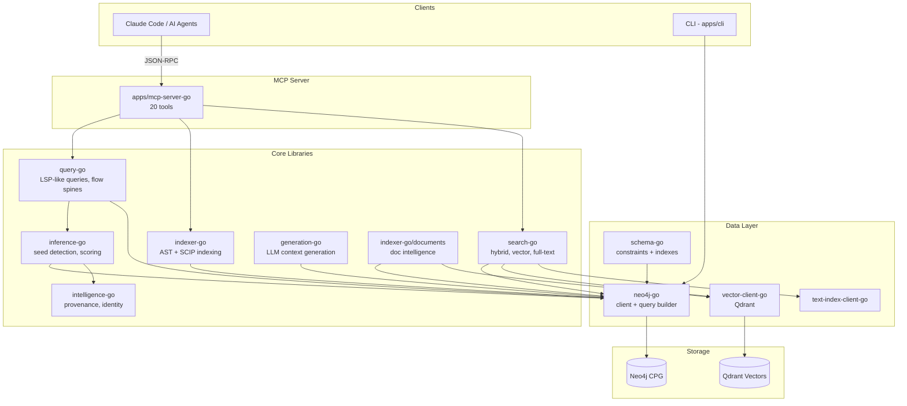
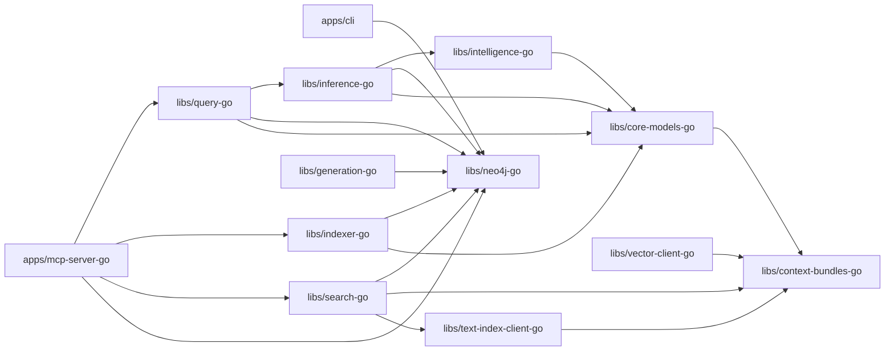

# Architecture Overview

CodeGraph is a Neo4j-based code intelligence platform that builds a **Code Property Graph (CPG)** from source code. It supports multi-language indexing via SCIP, document intelligence, hybrid search, and LLM-powered generation — all exposed through an MCP (Model Context Protocol) server for AI-assisted development.

## System Architecture



## Service Inventory

The codebase consists of **25 distinct services/packages** (excluding duplicated module paths):

### Applications

| Service | API Endpoints | Description |
|---------|:---:|-------------|
| `apps/cli` | 5 | Main CLI entry point (Cobra commands) |
| `apps/mcp-server-go` | 4 | MCP protocol server (20 tools) |
| `apps/docs-intel-py` | 0 | Python document intelligence service |

### Core Libraries

| Service | API Endpoints | Key Role |
|---------|:---:|----------|
| `libs/indexer-go` | 20 | AST + SCIP indexing, symbol extraction |
| `libs/search-go` | 11 | Hybrid search, vector, full-text, comment search |
| `libs/inference-go` | 9 | Seed detection, flow quality, link scoring |
| `libs/evals-go` | 9 | Evaluation and ablation testing |
| `libs/query-go` | 5 | LSP-like queries, flow spine generation |
| `libs/llm-go` | 4 | LLM client adapters |
| `libs/benchmarks-go` | 12 | Performance benchmarking |
| `libs/context-bundles-go` | 4 | Context bundle management |
| `libs/retrieval-go` | 3 | Retrieval orchestration |
| `libs/generation-go` | 2 | LLM-powered documentation generation |
| `libs/intelligence-go` | 2 | Provenance tracking, identity |
| `libs/core-models-go` | 2 | Shared graph data models |
| `libs/verification-go` | 1 | Output verification |
| `libs/schema-go` | 1 | Neo4j schema management |
| `libs/gds-go` | 1 | Neo4j Graph Data Science |
| `libs/neo4j-go` | 0 | Neo4j client + query builder |

### Services (Orchestration Layer)

| Service | API Endpoints | Description |
|---------|:---:|-------------|
| `services/retrieval-go` | 8 | Retrieval orchestration service |
| `services/indexing-go` | 5 | Indexing orchestration service |

## Dependency Graph



## Graph Schema

The Code Property Graph stores code structure as nodes and relationships in Neo4j:

```mermaid
erDiagram
    Service ||--o{ File : CONTAINS
    File ||--o{ Function : CONTAINS
    File ||--o{ Class : CONTAINS
    File ||--o{ Variable : CONTAINS
    Class ||--o{ Method : CONTAINS
    Class ||--|{ Interface : IMPLEMENTS
    Class ||--o{ Class : INHERITS_FROM
    Function ||--o{ Function : CALLS
    Method ||--o{ Function : CALLS
    Function ||--o{ Symbol : DEFINES
    Function ||--o{ Symbol : REFERENCES
    Function ||--o{ APIRoute : EXPOSES_API
    Flow ||--o{ Function : HAS_STEP
    Document ||--o{ Feature : DESCRIBES
    Document ||--o{ Function : MENTIONS
```

### Node Types

- **Service** — Microservice / application component
- **File** — Source code file
- **Function / Method** — Executable code units
- **Class / Interface** — OOP constructs
- **Symbol** — SCIP-formatted canonical symbol definitions
- **Variable / Parameter** — Data containers
- **APIRoute** — Detected API endpoints (HTTP, gRPC, etc.)
- **Flow** — Generated call chain documentation
- **Document / Feature** — Business/technical documents and requirements

### Key Relationships

- **CONTAINS** — Structural hierarchy (Service → File → Function)
- **CALLS** — Function/method invocations
- **DEFINES / REFERENCES** — Symbol definitions and usages
- **EXPOSES_API** — Function → APIRoute mapping
- **IMPLEMENTS / INHERITS_FROM** — OOP relationships
- **HAS_STEP** — Flow → Function step ordering
- **MENTIONS** — Document → Code cross-references
