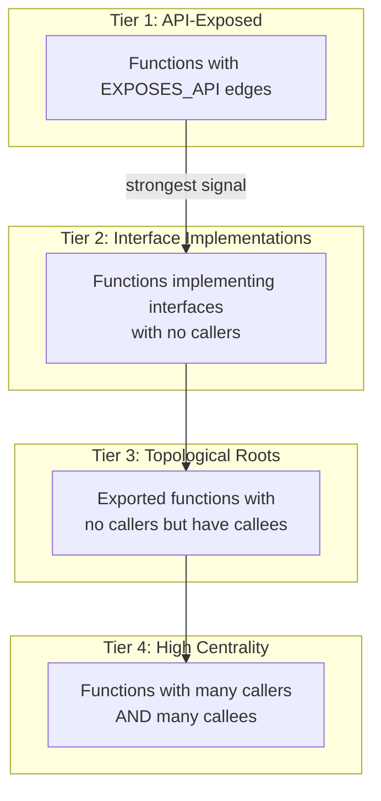
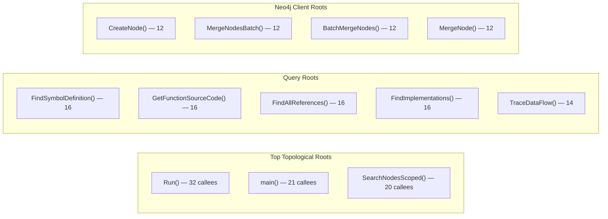
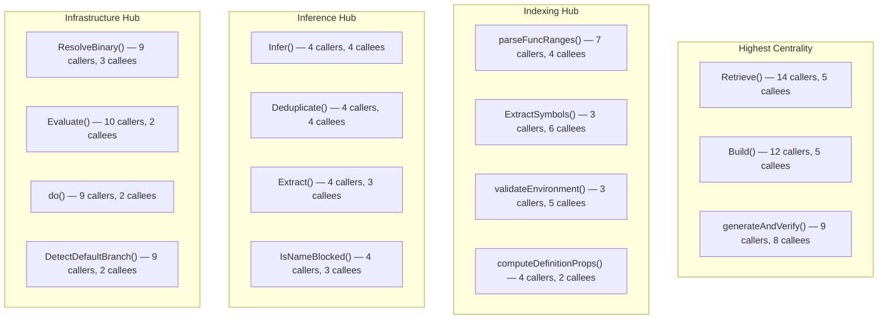

# Entry Points

CodeGraph detects entry points through 4 structural tiers, from most to least specific. Higher tiers represent stronger structural signals. Entry points can now be **scoped by service** using the `service_name` parameter.

## Per-Service Entry Points (Tier 1)

Entry points can be queried per-service using `service_name` filtering. Below are the key services and their entry points.

### MCP Server (`apps/mcp-server-go`) — 20 entry points

The MCP server exposes tool handlers as its primary entry points. Each handler corresponds to one of the 20 MCP tools.

| Function | File | Detection Source |
|----------|------|------------------|
| `handleSearchTool` | main.go | external_params |
| `handleGetSourceTool` | main.go | external_params |
| `handleFindReferencesTool` | main.go | external_params |
| `handleAnalyzeFunctionTool` | main.go | external_params |
| `handleHybridSearchTool` | main.go | external_params |
| `handleGenerateFlowsTool` | main.go | external_params |
| `handleGetEntryPointsTool` | main.go | external_params |
| `handleIndexDocumentsTool` | main.go | external_params |
| `handleSearchDocsTool` | main.go | external_params |
| `handleSearchByCommentTool` | main.go | external_params |
| `handleLinkDocsToCodeTool` | main.go | external_params |
| `handleIntelligentLinkTool` | main.go | external_params |
| `handleListServicesTool` | main.go | external_params |
| `handleServiceAPIEndpointsTool` | main.go | external_params |
| `handleServiceAPICallsTool` | main.go | external_params |
| `handleCrossServiceCallsTool` | main.go | external_params |
| `createEmbeddingServiceFromFlags` | main.go | external_params |
| `createLLMProvider` | main.go | external_params |
| `filterFlowsToWorkspace` | main.go | external_params |
| `findRelatedCodeForDocument` | main.go | external_params |

### Indexer (`libs/indexer-go`) — 20 entry points

| Function | File | Detection Source |
|----------|------|------------------|
| `AnalyzeBySymbols` | static/symbol_analyzer.go | external_params |
| `BuildCallGraph` | static/call_graph_scip.go | external_params |
| `ComputeDegreeProperties` | static/call_graph_scip.go | external_params |
| `CreateFileDeletedTombstones` | static/tombstone.go | external_params |
| `CreateSymbolRemovedTombstones` | static/tombstone.go | external_params |
| `Detect` (API surface) | static/api_surface.go | external_params |
| `DetectMessageConsumers` | static/semantic_edges.go | external_params |
| `DetectScheduledFunctions` | static/semantic_edges.go | external_params |
| `DetectSemanticEdges` | static/semantic_edges.go | external_params |
| `EnableIntelligentLinking` | documents/indexer.go | external_params |
| `ExtractCallsFromFunction` | static/call_graph.go | external_params |
| `ExtractDataFlows` | static/call_graph.go | external_params |
| `FetchDocument` | documents/confluence.go | external_params |
| `GenerateDocstringSuggestionsForScope` | generated/context.go | external_params+cross_pkg |
| `GenerateFlowSummariesForScope` | generated/context.go | external_params+cross_pkg |
| `GeneratePRSummaryForScope` | generated/context.go | external_params+cross_pkg |
| `GetDocumentStats` | documents/indexer.go | external_params |
| `IndexDirectory` | documents/indexer.go | external_params+cross_pkg |
| `IndexDocument` | documents/indexer.go | external_params |
| `CreatePullRequestNode` | generated/context.go | external_params |

### Query Engine (`libs/query-go`) — 20 entry points

| Function | File | Detection Source |
|----------|------|------------------|
| `AnalyzeComplexity` | advanced.go | external_params |
| `AnalyzeDependencies` | advanced.go | external_params |
| `AnalyzeImpact` | advanced.go | external_params |
| `BuildCallGraph` | advanced.go | external_params |
| `CreateServiceEdge` | service_deps.go | external_params |
| `FilterCandidates` | overlay.go | external_params+cross_pkg |
| `FindImplementations` | lsp.go | external_params |
| `FindReferences` | lsp.go | external_params |
| `GenerateCrossServiceFlows` | flow_spine.go | external_params |
| `GenerateFlows` | flow_spine.go | external_params |
| `GenerateFromAPIEndpoints` | flow_spine.go | external_params |
| `GenerateFromStructuralEntrypoints` | flow_spine.go | external_params |
| `GetCompletion` | lsp.go | external_params |
| `GetDependencies` | service_deps.go | external_params |
| `GetFlow` | flow_spine.go | external_params |
| `GetHover` | lsp.go | external_params |
| `GoToDefinition` | lsp.go | external_params |
| `InferServiceDependencies` | service_deps.go | external_params |
| `ListFlows` | flow_spine.go | external_params |
| `NewAdvancedQueryService` | advanced.go | external_params |

### Search (`libs/search-go`) — 20 entry points

| Function | File | Detection Source |
|----------|------|------------------|
| `AdvancedFullTextSearch` | fulltext_search.go | external_params |
| `AnalyzeDocument` | semantic_analyzer.go | external_params |
| `AnalyzeForCodeMapping` | semantic_analyzer.go | external_params+cross_pkg |
| `BatchUpdateEmbeddings` | vector_search.go | external_params |
| `CreateCommentEmbeddingIndex` | comment_embedding_service.go | external_params |
| `CreateFullTextIndexes` | fulltext_search.go | external_params+cross_pkg |
| `CreateIndex` | qdrant_vector_store.go | external_params |
| `CreateVectorIndexes` | vector_search.go | external_params |
| `DeleteVectors` | qdrant_vector_store.go | external_params |
| `DropFullTextIndex` | fulltext_search.go | external_params |
| `DropVectorIndex` | vector_search.go | external_params |
| `ExtractAndEmbedDocstrings` | comment_embedding_service.go | external_params |
| `ExtractAndSummarizeSubgraph` | code_summarizer.go | external_params+cross_pkg |
| `FullTextSearch` | fulltext_search.go | external_params |
| `GenerateBatchEmbeddings` | embedding_service.go | external_params |
| `GenerateEmbedding` | embedding_service.go | external_params |
| `GenerateSemanticEmbedding` | semantic_analyzer.go | external_params+cross_pkg |
| `GenerateText` | llm_service.go | external_params |
| `GenerateTextWithSystemPrompt` | llm_service.go | external_params |
| `GetFeatureImplementations` | feature_linker.go | external_params |

### Inference (`libs/inference-go`) — 20 entry points

| Function | File | Detection Source |
|----------|------|------------------|
| `BuildEvidenceRefs` | scorer.go | external_params+cross_pkg |
| `ClassifySeeds` | flow_seeds.go | cross_pkg |
| `ComputeFlowQuality` | flow_quality.go | cross_pkg |
| `Deduplicate` | flow_quality.go | cross_pkg |
| `DetectBoundaries` | cross_service.go | external_params |
| `Extract` | features.go | external_params+cross_pkg |
| `ExtractWithLexical` | features.go | external_params+cross_pkg |
| `FindSeeds` | graph_seeds.go | external_params |
| `Infer` | scorer.go | external_params+cross_pkg |
| `IsNameBlocked` | flow_quality.go | cross_pkg |
| `NewCrossServiceDetector` | cross_service.go | external_params+cross_pkg |
| `NewGraphSeedFinder` | graph_seeds.go | external_params |
| `NewLinkInferrer` | scorer.go | cross_pkg |
| `NewScorer` | scorer.go | cross_pkg |
| `Score` | scorer.go | cross_pkg |
| `SetScope` | cross_service.go | cross_pkg |
| `SetScope` | graph_seeds.go | cross_pkg |
| `WithFrameworkBoosters` | flow_seeds.go | external_params+cross_pkg |
| `computeLexicalOverlap` | features.go | cross_pkg |
| `computeStructuralSupport` | features.go | cross_pkg |

### Intelligence (`libs/intelligence-go`) — 6 entry points

| Function | File | Detection Source |
|----------|------|------------------|
| `Execute` | rollout/rollout.go | external_params |
| `ExecutePlan` | replay/replay.go | external_params |
| `MustValidate` | provenance/provenance.go | external_params |
| `Plan` | replay/replay.go | external_params |
| `Validate` | provenance/provenance.go | external_params |
| `BuildMentionEdgeProps` | provenance/provenance.go | T4: 7 callers, 2 callees |

### Detection Sources

- **external_params** — Function accepts parameters from outside the package (context, interfaces, etc.)
- **cross_pkg** — Function is called from other packages
- **external_params+cross_pkg** — Both signals present (strongest Tier 1 indicator)

## Tier 3: Topological Roots (25 detected)

Exported functions with zero incoming callers but non-zero outgoing calls — these are structural "starting points" in the call graph.

| Function | File | Callees |
|----------|------|:-------:|
| `Run` | stages.go | 32 |
| `main` | main.go | 21 |
| `SearchNodesScoped` | query.go | 20 |
| `FindSymbolDefinition` | query.go | 16 |
| `GetFunctionSourceCode` | query.go | 16 |
| `FindAllReferences` | query.go | 16 |
| `FindImplementations` | query.go | 16 |
| `GetFunctionSourceCodeBySignature` | query.go | 16 |
| `TraceDataFlow` | query.go | 14 |
| `FindAPIEndpointsAffectedByFunction` | query.go | 14 |
| `CreateNode` | client.go | 12 |
| `MergeNodesBatch` | client.go | 12 |
| `DiscoverServiceDependencies` | query.go | 12 |
| `CreateRelsBatch` | client.go | 12 |
| `FindNodeByProperty` | query.go | 12 |
| `SetNodeProperty` | client.go | 12 |
| `GetDatabaseInfo` | client.go | 12 |
| `SemanticSearch` | query.go | 12 |
| `BatchMergeNodes` | client.go | 12 |
| `MergeNode` | client.go | 12 |
| `SetNodeProperties` | client.go | 12 |
| `MergeRelationship` | client.go | 12 |
| `FindNodesByLabel` | query.go | 12 |
| `BatchCreateRelationships` | client.go | 12 |
| `CreateRelationship` | client.go | 12 |

## Tier 4: High Centrality (25 detected)

Functions that serve as critical connectors — they have many callers AND many callees, making them central to the codebase's control flow.

| Function | File | Callers | Callees | Centrality |
|----------|------|:-------:|:-------:|:----------:|
| `Retrieve` | orchestrator.go | 14 | 5 | 19 |
| `Build` | builder.go | 12 | 5 | 17 |
| `generateAndVerify` | context.go | 9 | 8 | 17 |
| `monitorAgent` | orchestrator.go | 9 | 4 | 13 |
| `ResolveBinary` | indexer_manager.go | 9 | 3 | 12 |
| `Evaluate` | policy.go | 10 | 2 | 12 |
| `parseFuncRanges` | call_graph_scip.go | 7 | 4 | 11 |
| `do` | client.go | 9 | 2 | 11 |
| `DetectDefaultBranch` | manager.go | 9 | 2 | 11 |
| `Start` | phase_timer.go | 8 | 2 | 10 |
| `Generate` | generator.go | 6 | 3 | 9 |
| `ExtractSymbols` | scip_parser.go | 3 | 6 | 9 |
| `BuildMentionEdgeProps` | provenance.go | 7 | 2 | 9 |
| `GetWithOverlay` | store_mock.go | 5 | 3 | 8 |
| `validateEnvironment` | scip_indexer.go | 3 | 5 | 8 |
| `Infer` | scorer.go | 4 | 4 | 8 |
| `Deduplicate` | flow_quality.go | 4 | 4 | 8 |
| `Extract` | features.go | 4 | 3 | 7 |
| `IsNameBlocked` | flow_quality.go | 4 | 3 | 7 |
| `scheduleCleanup` | orchestrator.go | 5 | 2 | 7 |
| `watchVMEvents` | orchestrator.go | 5 | 2 | 7 |
| `PrintTable` | phase_timer.go | 3 | 3 | 6 |
| `computeDefinitionProps` | scip_indexer.go | 4 | 2 | 6 |
| `NewLinkInferrer` | scorer.go | 4 | 2 | 6 |
| `performHeuristicValidation` | llm_validator.go | 3 | 3 | 6 |
