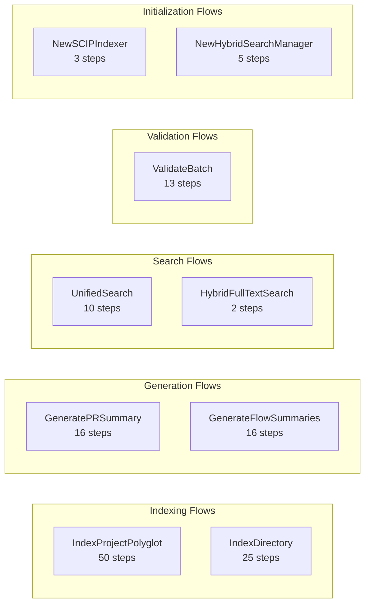
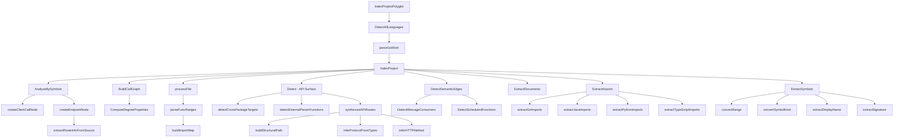
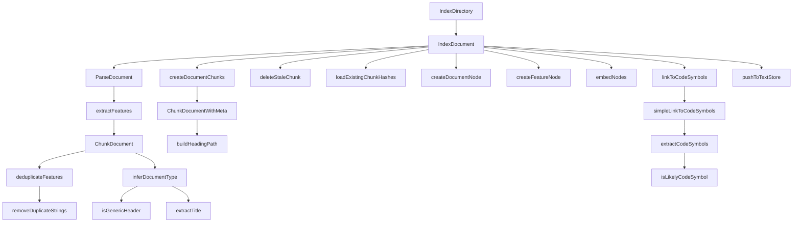
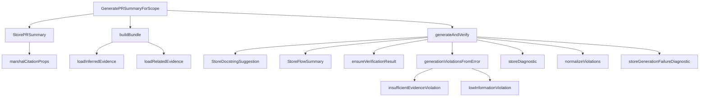
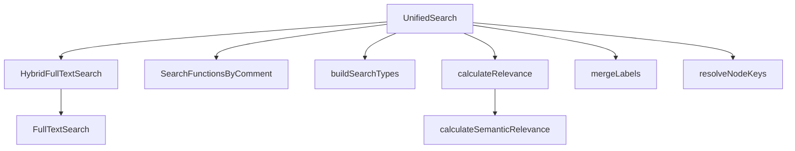
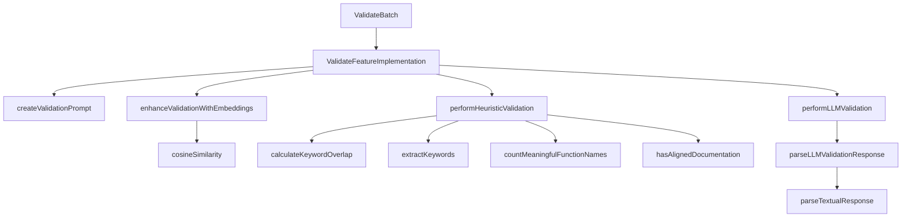
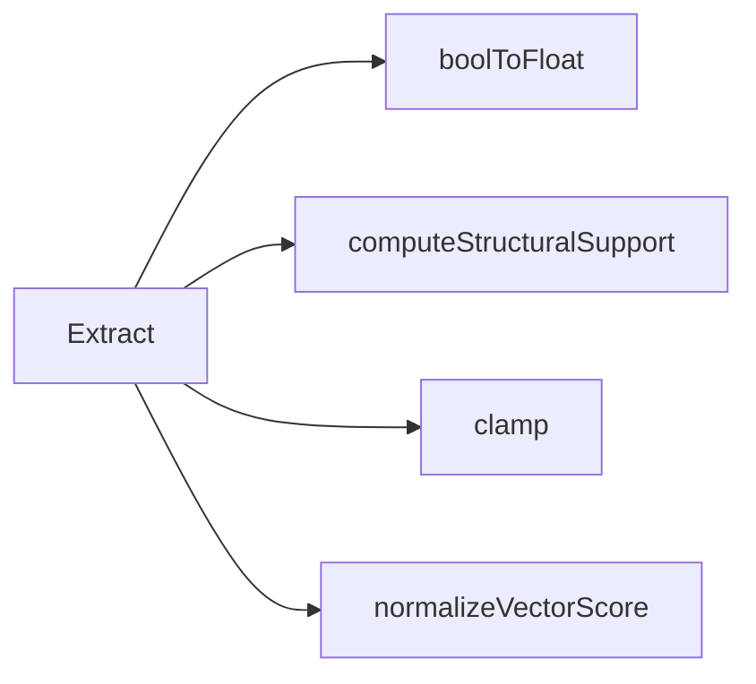

# Flow Spines

Flow spines trace how a request flows through the codebase from an entry point, following `CALLS` edges in the graph. Each flow represents a complete execution path.

## Summary

---

## Flow 1: Polyglot Indexing Pipeline (50 steps)

The largest flow in the codebase — the complete multi-language indexing pipeline.

### Step-by-step

| Step | Function | Role |
|:----:|----------|------|
| 1 | `IndexProjectPolyglot` | Entry: multi-language project indexing |
| 2 | `DetectAllLanguages` | Scan project for language markers |
| 3 | `parseGoWork` | Parse Go workspace files |
| 4-5 | `IndexProject` | Per-language SCIP/AST indexing |
| 6 | `AnalyzeBySymbols` | Symbol-level cross-reference analysis |
| 7-11 | Client call + endpoint detection | Build API route nodes |
| 12-13 | `BuildCallGraph` → `ComputeDegreeProperties` | Call graph construction |
| 14-21 | `processFile` → AST parsing helpers | File-level code parsing |
| 22-28 | `Detect` → API surface synthesis | Structural API detection |
| 29-31 | `DetectSemanticEdges` | Message consumers, scheduled functions |
| 32-39 | `ExtractDocuments` | Inline doc extraction |
| 40-44 | `ExtractImports` | Multi-language import resolution |
| 45-50 | `ExtractSymbols` | SCIP symbol extraction + normalization |

---

## Flow 2: Document Indexing Pipeline (25 steps)

---

## Flow 3: PR Summary Generation (16 steps)

---

## Flow 4: Unified Search (10 steps)

---

## Flow 5: Validation Pipeline (13 steps)

---

## Flow 6: Feature Extraction (5 steps)

---

## Other Flows

| Flow | Steps | Description |
|------|:-----:|-------------|
| `NewSCIPIndexer` | 3 | SCIP indexer initialization chain |
| `GenerateSemanticEmbedding` | 2 | Embedding generation with preprocessing |
| `ExtractAndSummarizeSubgraph` | 6 | Subgraph extraction + LLM summarization |
| `NewHybridSearchManager` | 5 | Search manager initialization |
| `HybridFullTextSearch` | 2 | Hybrid → full-text delegation |
| `FindRelationships` | 2 | Relationship query with type filtering |
| `CreateFullTextIndexes` | 2 | Full-text index creation |
| `ComputeLatencyStats` | 2 | Latency percentile computation |
