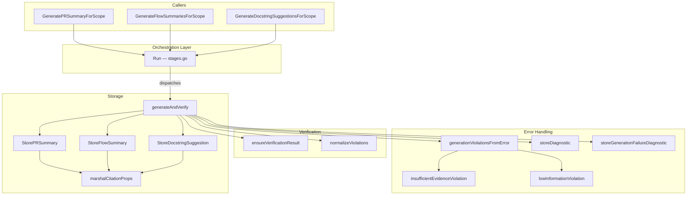
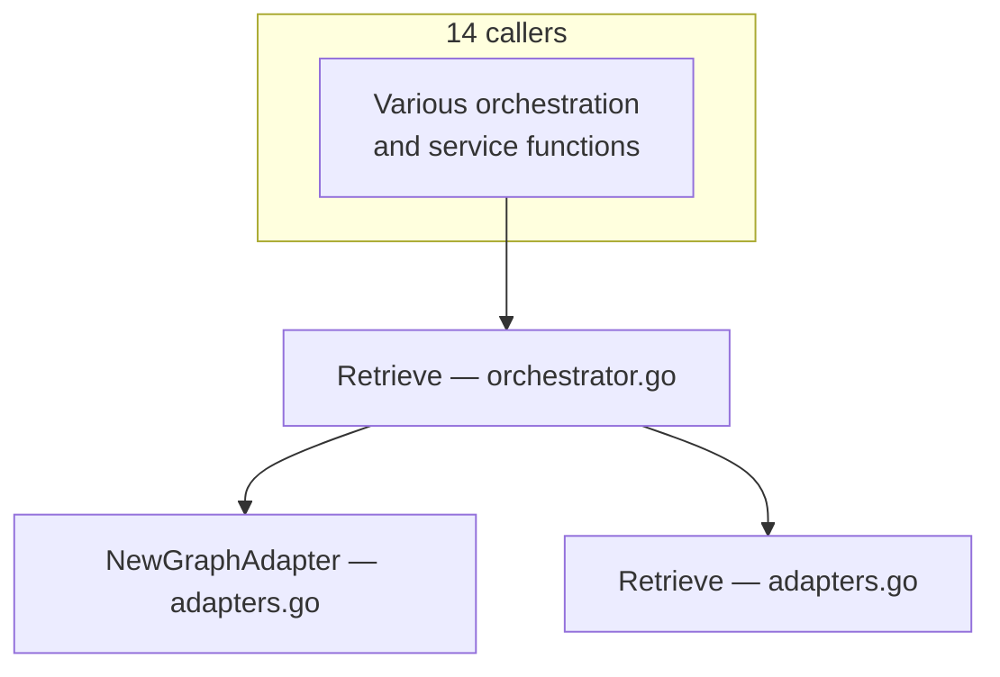
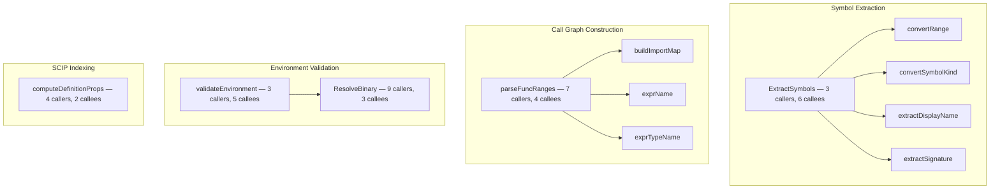
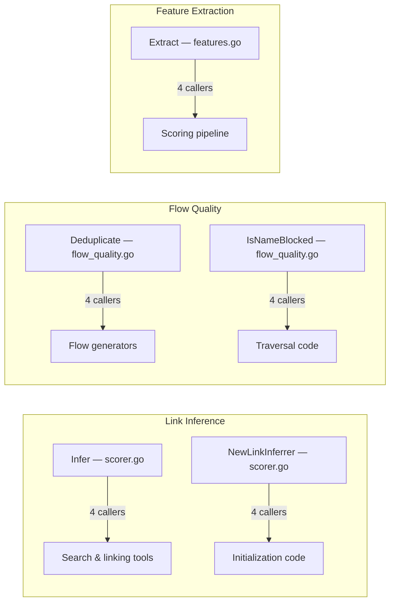

# Call Graph Analysis

Deep call graph traces for the most architecturally significant functions, generated by traversing `CALLS` edges in the Code Property Graph.

## MCP Server Dispatch — `handleToolCall`

The central dispatch function in the MCP server routes JSON-RPC tool calls to 17 handler functions (plus the 3 new intelligence tools).

```mermaid
graph TD
    HTC[handleToolCall]

    HTC --> H1[handleSearchTool]
    HTC --> H2[handleGetSourceTool]
    HTC --> H3[handleFindReferencesTool]
    HTC --> H4[handleAnalyzeFunctionTool]
    HTC --> H5[handleHybridSearchTool]
    HTC --> H6[handleVectorSearchTool]
    HTC --> H7[handleIndexDocumentsTool]
    HTC --> H8[handleSearchDocsTool]
    HTC --> H9[handleSearchByCommentTool]
    HTC --> H10[handleLinkDocsToCodeTool]
    HTC --> H11[handleIntelligentLinkTool]
    HTC --> H12[handleListServicesTool]
    HTC --> H13[handleServiceDependenciesTool]
    HTC --> H14[handleServiceAPIEndpointsTool]
    HTC --> H15[handleServiceAPICallsTool]
    HTC --> H16[handleCrossServiceCallsTool]
    HTC --> H17[handleServiceArchitectureTool]
    HTC --> SE[sendError]
    HTC --> SR[sendResponse]

    H7 --> DLP[detectLanguageFromPath]
    H7 --> FRC[findRelatedCodeForDocument]

    H4 --> GS[getStringFromRecord]
    H4 --> GI[getIntFromRecord]
    H4 --> GB[getBoolFromRecord]
```

### Handler Categories

| Category | Handlers | Purpose |
|----------|----------|---------|
| **Search** | `handleSearchTool`, `handleHybridSearchTool`, `handleVectorSearchTool` | Code entity search |
| **Source** | `handleGetSourceTool`, `handleAnalyzeFunctionTool`, `handleFindReferencesTool` | Code inspection |
| **Documents** | `handleIndexDocumentsTool`, `handleSearchDocsTool`, `handleSearchByCommentTool` | Document intelligence |
| **Linking** | `handleLinkDocsToCodeTool`, `handleIntelligentLinkTool` | Doc ↔ code relationships |
| **Architecture** | `handleListServicesTool`, `handleServiceDependenciesTool`, `handleServiceArchitectureTool` | Service topology |
| **API** | `handleServiceAPIEndpointsTool`, `handleServiceAPICallsTool`, `handleCrossServiceCallsTool` | API surface |

---

## Generation Core — `generateAndVerify`

The central generation function used by all documentation generators. It coordinates LLM generation with evidence verification.

### Key observations

- **9 callers** (3 generators + 6 test functions) — this is the single most-called internal function
- **8 callees** — stores results, verifies output, handles errors
- All three generation scopes (`PR`, `Flow`, `Docstring`) converge through this function
- `Run()` in stages.go orchestrates the generation pipeline and dispatches to all three generators

---

## Retrieval Hub — `Retrieve`

The highest-centrality function in the codebase (14 callers, 5 callees).

---

## Indexing Hub — Key Centrality Functions

Functions that serve as critical junctions in the indexing pipeline:

---

## Inference Hub

Functions central to the inference and scoring subsystem:

---

## Infrastructure Hub

Cross-cutting infrastructure functions with high caller counts:

| Function | File | Callers | Callees | Role |
|----------|------|:-------:|:-------:|------|
| `Evaluate` | policy.go | 10 | 2 | Policy evaluation for all generators |
| `ResolveBinary` | indexer_manager.go | 9 | 3 | SCIP binary resolution for all languages |
| `do` | client.go | 9 | 2 | HTTP client core request handler |
| `DetectDefaultBranch` | manager.go | 9 | 2 | Git branch detection |
| `Start` | phase_timer.go | 8 | 2 | Benchmark phase tracking |
| `BuildMentionEdgeProps` | provenance.go | 7 | 2 | Provenance edge construction |
