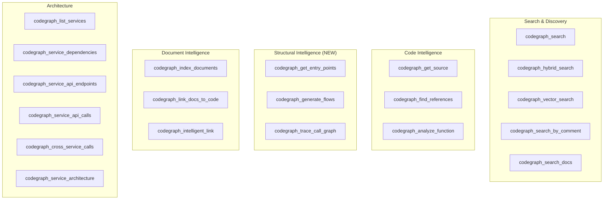

# MCP Tools Reference

CodeGraph exposes 20 MCP tools via JSON-RPC over stdio. These tools give AI agents structural intelligence about the codebase.

## Tool Categories

---

## Search & Discovery

### `codegraph_search`
Search for functions, methods, classes, and other code entities by name.

| Parameter | Type | Required | Default | Description |
|-----------|------|:--------:|:-------:|-------------|
| `query` | string | yes | — | Search term |
| `limit` | number | no | 20 | Max results |
| `types` | array | no | — | Filter by entity types (Function, Method, Class, etc.) |

### `codegraph_hybrid_search`
Hybrid semantic search combining vector similarity, full-text, and graph queries.

| Parameter | Type | Required | Default | Description |
|-----------|------|:--------:|:-------:|-------------|
| `query` | string | yes | — | Natural language search query |
| `limit` | number | no | 10 | Max results |

### `codegraph_vector_search`
Pure vector similarity search using embeddings.

| Parameter | Type | Required | Default | Description |
|-----------|------|:--------:|:-------:|-------------|
| `query` | string | yes | — | Query text to vectorize |
| `limit` | number | no | 10 | Max results |

### `codegraph_search_by_comment`
Find functions/methods by their docstrings and comments using semantic similarity.

| Parameter | Type | Required | Default | Description |
|-----------|------|:--------:|:-------:|-------------|
| `query` | string | yes | — | Natural language description |
| `limit` | number | no | 10 | Max results |

### `codegraph_search_docs`
Search documents using natural language and find related code.

| Parameter | Type | Required | Default | Description |
|-----------|------|:--------:|:-------:|-------------|
| `query` | string | yes | — | Natural language search query |
| `limit` | number | no | 10 | Max results |
| `include_code` | boolean | no | true | Include related code symbols |

---

## Code Intelligence

### `codegraph_get_source`
Retrieve exact source code for a function or method.

| Parameter | Type | Required | Default | Description |
|-----------|------|:--------:|:-------:|-------------|
| `function_name` | string | yes | — | Function/method name |

### `codegraph_find_references`
Find all references (usages) of a specific symbol.

| Parameter | Type | Required | Default | Description |
|-----------|------|:--------:|:-------:|-------------|
| `symbol` | string | yes | — | Symbol to find references for |

### `codegraph_analyze_function`
Detailed function analysis: callers, callees, metadata.

| Parameter | Type | Required | Default | Description |
|-----------|------|:--------:|:-------:|-------------|
| `function_name` | string | yes | — | Function to analyze |

---

## Structural Intelligence

These tools expose the graph's deeper structural signals for autonomous exploration.

### `codegraph_get_entry_points`
List structurally-detected entry points across 4 tiers.

| Parameter | Type | Required | Default | Description |
|-----------|------|:--------:|:-------:|-------------|
| `tier` | number | no | all | Filter by tier (1-4) |
| `limit` | number | no | 50 | Max results |

**Tiers:**
1. **API-exposed** — Functions with `EXPOSES_API` edges
2. **Interface implementations** — Functions implementing interfaces with no callers
3. **Topological roots** — Exported, no callers, has callees
4. **High centrality** — Many callers AND many callees

### `codegraph_generate_flows`
Generate flow spines — call chain documentation from entry points.

| Parameter | Type | Required | Default | Description |
|-----------|------|:--------:|:-------:|-------------|
| `max_depth` | number | no | 5 | Call chain depth |
| `limit` | number | no | 20 | Max flows |

### `codegraph_trace_call_graph`
Traverse the call graph upstream or downstream from a function.

| Parameter | Type | Required | Default | Description |
|-----------|------|:--------:|:-------:|-------------|
| `function_name` | string | yes | — | Function to trace from |
| `direction` | string | no | downstream | `downstream`, `upstream`, or `both` |
| `max_depth` | number | no | 3 | Traversal depth (max 10) |

---

## Document Intelligence

### `codegraph_index_documents`
Index markdown/text documents with embeddings and code relationships.

| Parameter | Type | Required | Default | Description |
|-----------|------|:--------:|:-------:|-------------|
| `path` | string | yes | — | Directory or file path |
| `generate_embeddings` | boolean | no | true | Generate embeddings |

### `codegraph_link_docs_to_code`
Create explicit relationships between documents and referenced code symbols.

| Parameter | Type | Required | Default | Description |
|-----------|------|:--------:|:-------:|-------------|
| `doc_path` | string | yes | — | Document file path |
| `auto_detect` | boolean | no | true | Auto-detect backtick references |

### `codegraph_intelligent_link`
Create semantic relationships between documents and code using LLM analysis.

| Parameter | Type | Required | Default | Description |
|-----------|------|:--------:|:-------:|-------------|
| `doc_path` | string | yes | — | Document file path |
| `confidence_threshold` | number | no | 0.2 | Min confidence (0.0-1.0) |

---

## Architecture

### `codegraph_list_services`
List all services with metadata.

| Parameter | Type | Required | Default | Description |
|-----------|------|:--------:|:-------:|-------------|
| `name_filter` | string | no | — | Substring filter |

### `codegraph_service_dependencies`
Get DEPENDS_ON relationships for a service.

| Parameter | Type | Required | Default | Description |
|-----------|------|:--------:|:-------:|-------------|
| `service_name` | string | yes | — | Service name |

### `codegraph_service_api_endpoints`
Get API endpoints exposed by a service.

| Parameter | Type | Required | Default | Description |
|-----------|------|:--------:|:-------:|-------------|
| `service_name` | string | yes | — | Service name |
| `limit` | number | no | 50 | Max results |

### `codegraph_service_api_calls`
Get API calls made by a service.

| Parameter | Type | Required | Default | Description |
|-----------|------|:--------:|:-------:|-------------|
| `service_name` | string | yes | — | Service name |
| `limit` | number | no | 50 | Max results |

### `codegraph_cross_service_calls`
Get cross-service call chains.

| Parameter | Type | Required | Default | Description |
|-----------|------|:--------:|:-------:|-------------|
| `from_service` | string | no | — | Source service filter |
| `to_service` | string | no | — | Target service filter |
| `limit` | number | no | 20 | Max results |

### `codegraph_service_architecture`
Comprehensive architecture overview of all services and relationships.

No parameters required.
