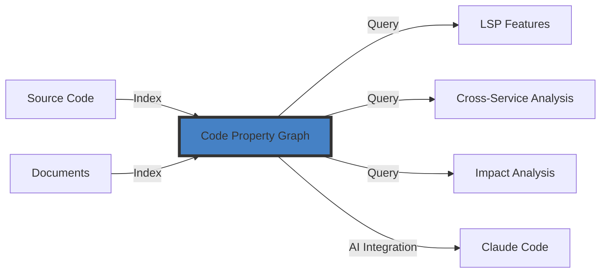
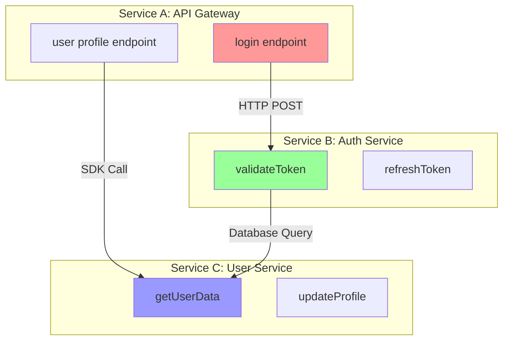
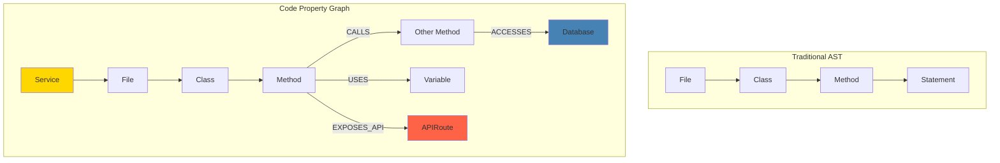
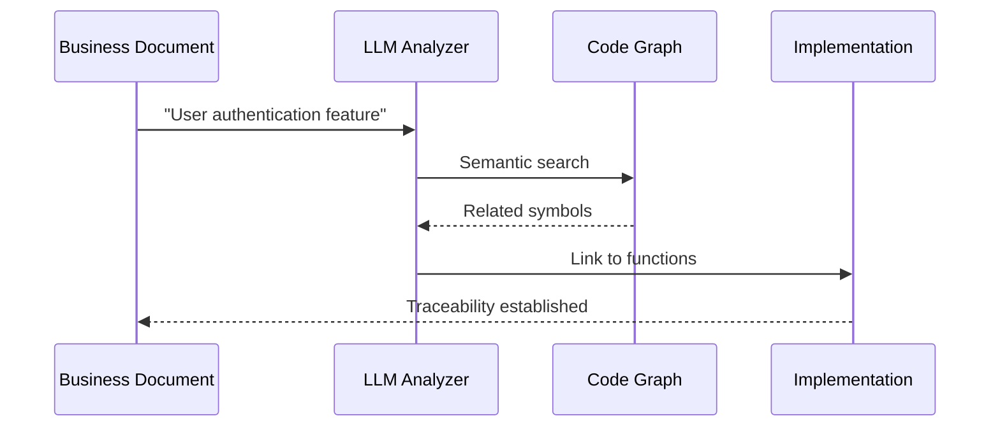
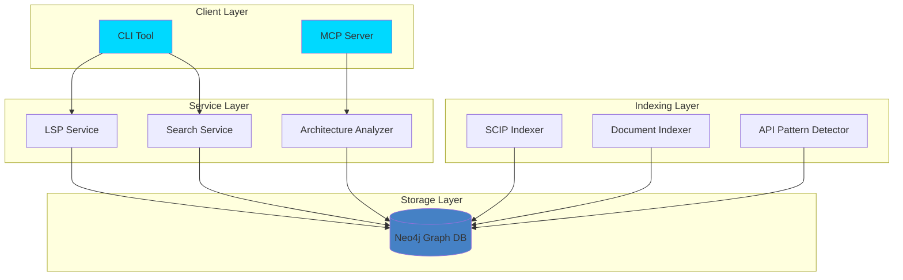

# What is CodeGraph?

## Overview

CodeGraph is a comprehensive code intelligence platform that transforms your codebase into a queryable **Code Property Graph (CPG)** using Neo4j as the backend. It provides deep insights into code structure, dependencies, and relationships across multiple programming languages and microservices.

## The Problem

Modern software development faces several challenges:

- **Complex Codebases**: Large monorepos and microservice architectures are difficult to navigate
- **Language Fragmentation**: Teams use multiple programming languages (Go, TypeScript, Python, Java)
- **Knowledge Silos**: Understanding how services interact is time-consuming
- **Impact Analysis**: Changing code without knowing what breaks is risky
- **Documentation Drift**: Documentation becomes outdated quickly

##The Solution

CodeGraph addresses these challenges by creating a **unified graph** of your entire codebase:



## Key Capabilities

### 1. Multi-Language Support

CodeGraph uses the [SCIP Protocol](https://github.com/sourcegraph/scip) for cross-language code intelligence:

| Language | Status | SCIP Indexer |
|----------|--------|--------------|
| Go | ✅ Full Support | scip-go |
| TypeScript | ✅ Full Support | scip-typescript |
| JavaScript | ✅ Full Support | scip-typescript |
| Python | ✅ Full Support | scip-python |
| Java/Scala/Kotlin | ✅ Full Support | scip-java |

### 2. Cross-Service Relationship Tracking



CodeGraph automatically detects:
- API endpoints (REST, GraphQL)
- HTTP calls (axios, fetch)
- SDK calls between services
- Package dependencies
- Database queries

### 3. Semantic Code Understanding

Beyond syntax trees, CodeGraph captures semantic relationships:



### 4. Business-to-Code Traceability

Link requirements and features to actual code implementation:



## Architecture Highlights

### Layered Design



## Use Cases

### For Developers

**Code Navigation**
```bash
# Find all references to a function
codegraph query search "processPayment"

# Get function source code
codegraph query source "validateUser"
```

**Impact Analysis**
```cypher
// Find all API endpoints affected by a function change
MATCH (f:Function {name: 'calculateDiscount'})-[:CALLS*]->(downstream)
MATCH (downstream)-[:EXPOSES_API]->(api:APIRoute)
RETURN DISTINCT api.method, api.endpoint
```

### For Architects

**Service Mapping**
```bash
# Visualize service dependencies
codegraph query service-architecture

# Find circular dependencies
codegraph query circular-deps
```

**API Discovery**
```bash
# List all API endpoints
codegraph query list-apis --service="payment-service"

# Find who calls this API
codegraph query api-consumers --endpoint="/api/v1/payment"
```

### For Product Teams

**Feature Tracking**
```bash
# Link feature to code
codegraph link features ./docs/features/user-auth.md

# Find code implementing feature
codegraph query feature-code "User Authentication"
```

## Why Neo4j?

CodeGraph uses Neo4j for several key reasons:

| Requirement | Neo4j Advantage |
|-------------|-----------------|
| **Graph Queries** | Native graph traversal with Cypher |
| **Performance** | Indexed graph navigation |
| **Flexibility** | Schema-less property graph |
| **Scalability** | Handles millions of nodes/relationships |
| **Tooling** | Browser, monitoring, backups |

### Example: Find Call Chain

Traditional approach (many queries):
```sql
-- Query 1: Find function
SELECT * FROM functions WHERE name = 'login';

-- Query 2: Find its calls (repeat for each level)
SELECT * FROM calls WHERE caller_id = ?;

-- Query 3-N: Keep querying...
```

Neo4j approach (one query):
```cypher
MATCH path = (start:Function {name: 'login'})-[:CALLS*1..10]->(end:Function)
WHERE end.name CONTAINS 'database'
RETURN path
```

## Getting Started

```bash
# One-command installation
curl -fsSL https://raw.githubusercontent.com/techsavvyash/codegraph/master/install.sh | bash

# Index your project
codegraph index scip ./my-project --service="my-service"

# Start exploring
codegraph query search "myFunction"
```

## What's Next?

- **[Architecture](02-architecture.md)** - Deep dive into system design
- **[Graph Schema](03-graph-schema.md)** - Understanding the data model  
- **[Indexing Guide](04-indexing.md)** - How code gets into the graph
- **[CLI Reference](05-cli-reference.md)** - All commands
- **[MCP Reference](06-mcp-reference.md)** - AI assistant integration
- **[Installation](07-installation.md)** - Setup guide
