# CodeGraph Architecture

## System Overview

CodeGraph is built using a layered architecture that separates concerns between indexing, storage, querying, and client interfaces.

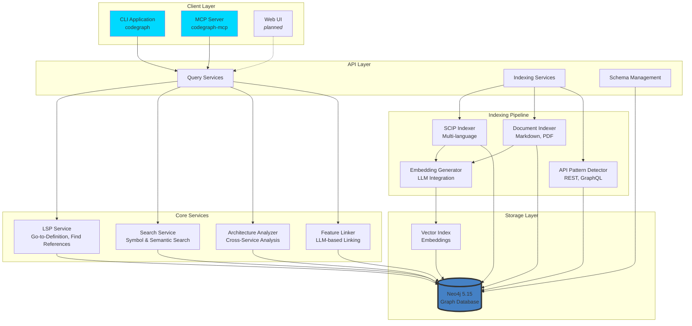

## Component Details

### 1. Client Layer

#### CLI Application (`cmd/codegraph/`)

The command-line interface provides direct access to all CodeGraph functionality:

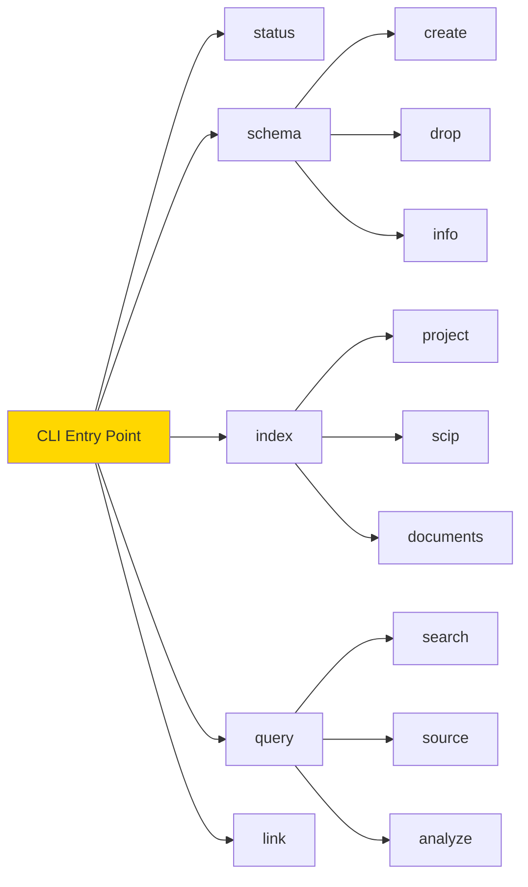

**Key Features:**
- Cobra-based command structure
- Configuration management (`~/.codegraph.yaml`)
- Environment variable support
- Pretty-printed output
- Progress indicators

#### MCP Server (`mcp-server/`)

Model Context Protocol server for AI assistant integration:

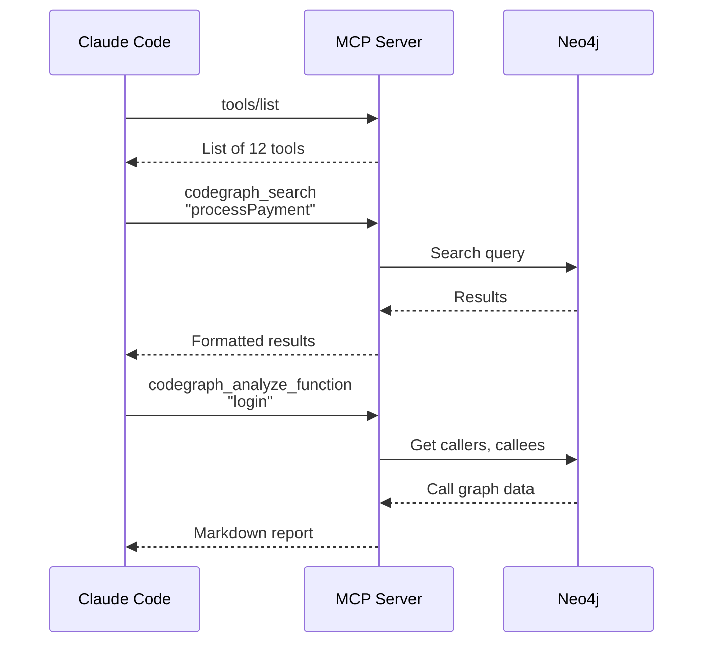

**Available Tools:**
- Code intelligence (search, source, analyze)
- Document intelligence (index, show, link)
- Service architecture (dependencies, APIs, call chains)

### 2. Core Services

#### LSP Service (`pkg/query/lsp.go`)

Provides Language Server Protocol-like features:

```go
type LSPService struct {
    client       *neo4j.Client
    queryBuilder *neo4j.QueryBuilder
}

// Features
func (s *LSPService) GoToDefinition(ctx, symbol) (*Definition, error)
func (s *LSPService) FindReferences(ctx, symbol) ([]Reference, error)
func (s *LSPService) FindImplementations(ctx, symbol) ([]Implementation, error)
func (s *LSPService) Hover(ctx, symbol) (*HoverInfo, error)
```

**Query Pattern:**
```cypher
// Go-to-Definition
MATCH (sym:Symbol {scipSymbol: $symbol})
RETURN sym.filePath, sym.startLine, sym.endLine

// Find References
MATCH (sym:Symbol {scipSymbol: $symbol})
MATCH (ref:Symbol)-[:REFERENCES]->(sym)
RETURN ref.filePath, ref.line
```

#### Search Service (`pkg/query/search.go`)

Multi-strategy search capabilities:

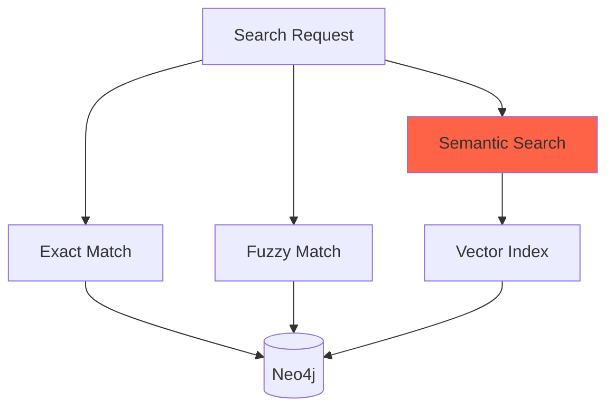

**Search Strategies:**
1. **Exact Match**: Direct symbol name matching
2. **Fuzzy Match**: Case-insensitive partial matching  
3. **Semantic Search**: Vector similarity (embeddings)

#### Architecture Analyzer (`pkg/indexer/static/api_analyzer.go`)

Detects and analyzes cross-service relationships:

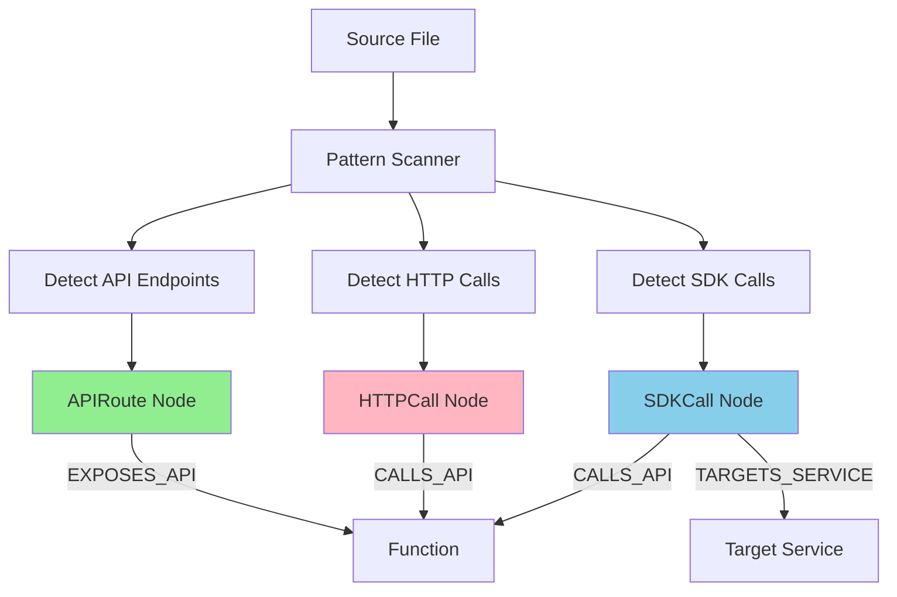

**Pattern Detection:**
```go
// API Endpoints
patterns := map[string][]*regexp.Regexp{
    "elysia":  regexp.MustCompile(`\.(?:get|post|put|delete|patch)\(['"]([^'"]+)['"]`),
    "express": regexp.MustCompile(`app\.(?:get|post|put|delete|patch)\(['"]([^'"]+)['"]`),
    "go_http": regexp.MustCompile(`http\.HandleFunc\(['"]([^'"]+)['"]`),
}

// HTTP Calls
httpCallPatterns := []*regexp.Regexp{
    regexp.MustCompile(`axios\.(?:get|post|put|delete|patch)\(['"]([^'"]+)['"]`),
    regexp.MustCompile(`fetch\(['"]([^'"]+)['"]`),
}

// SDK Calls
sdkCallPattern := regexp.MustCompile(`(\w+Client)\.(\w+)\(`)
```

### 3. Indexing Pipeline

#### SCIP Indexer (`pkg/indexer/static/scip_indexer.go`)

Multi-language code indexing via SCIP protocol:

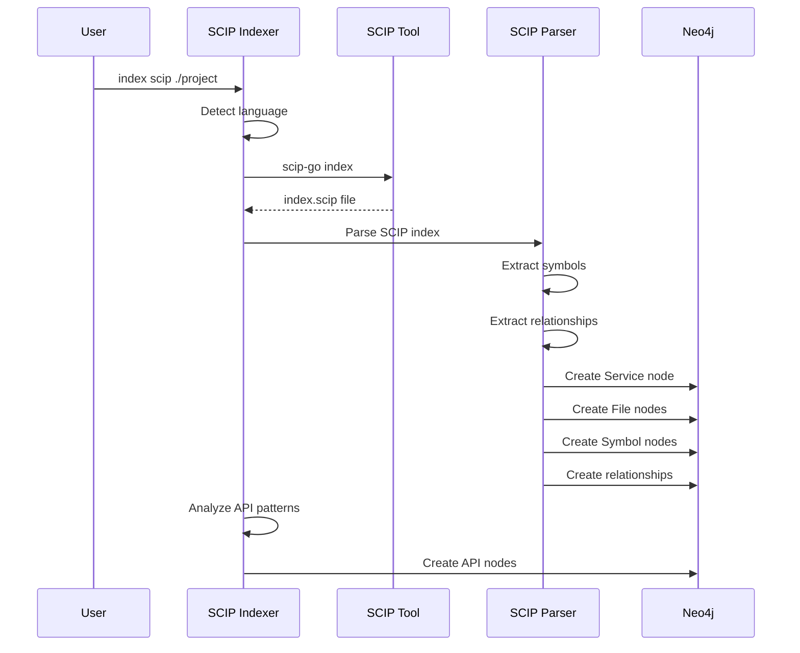

**Language Detection:**
```go
func (si *SCIPIndexer) DetectLanguage(projectPath string) Language {
    // Check for language-specific files
    if fileExists(filepath.Join(projectPath, "go.mod")) {
        return LanguageGo
    }
    if fileExists(filepath.Join(projectPath, "tsconfig.json")) {
        return LanguageTypeScript
    }
    if fileExists(filepath.Join(projectPath, "package.json")) {
        return detectJSorTS(projectPath)
    }
    if fileExists(filepath.Join(projectPath, "requirements.txt")) {
        return LanguagePython
    }
    // ... more languages
}
```

#### Document Indexer (`pkg/indexer/documents/indexer.go`)

Indexes business documents and links them to code:

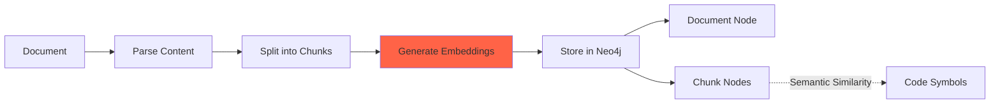

**Document Processing:**
```go
func (di *DocumentIndexer) IndexDocument(filePath string) error {
    // 1. Parse document (Markdown, PDF, etc.)
    content := di.parseDocument(filePath)
    
    // 2. Split into semantic chunks
    chunks := di.chunkDocument(content)
    
    // 3. Generate embeddings via LLM
    embeddings := di.generateEmbeddings(chunks)
    
    // 4. Store in Neo4j
    docNode := di.createDocumentNode(filePath, content)
    chunkNodes := di.createChunkNodes(chunks, embeddings)
    
    // 5. Link to code (optional)
    if di.autoLink {
        di.linkDocumentToCode(docNode, chunkNodes)
    }
}
```

#### API Pattern Detector

Scans files for API patterns and creates relationship nodes:

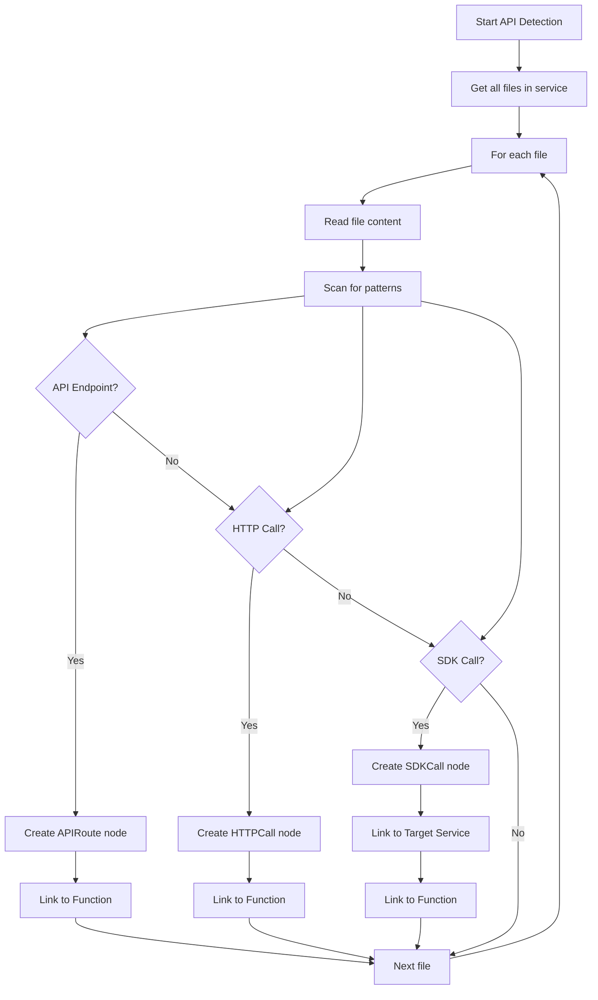

### 4. Storage Layer

#### Neo4j Graph Database

Configuration and optimization:

```yaml
# docker-compose.yml
services:
  neo4j:
    image: neo4j:5.15-community
    environment:
      - NEO4J_AUTH=neo4j/password123
      - NEO4J_PLUGINS=["apoc","apoc-extended"]
      
      # Memory settings
      - NEO4J_server_memory_heap_initial__size=256m
      - NEO4J_server_memory_heap_max__size=1g
      - NEO4J_server_memory_pagecache_size=512m
      
      # Connection tuning
      - NEO4J_dbms_connector_bolt_thread__pool__max__size=20
      - NEO4J_dbms_connector_bolt_thread__pool__min__size=5
```

**Schema Constraints:**
```cypher
// Unique constraints for efficient lookups
CREATE CONSTRAINT service_name IF NOT EXISTS
FOR (s:Service) REQUIRE s.name IS UNIQUE;

CREATE CONSTRAINT symbol_scip IF NOT EXISTS
FOR (s:Symbol) REQUIRE s.scipSymbol IS UNIQUE;

CREATE CONSTRAINT file_path IF NOT EXISTS
FOR (f:File) REQUIRE (f.serviceName, f.path) IS NODE KEY;
```

**Indexes:**
```cypher
// Full-text search indexes
CREATE FULLTEXT INDEX symbolNameIndex IF NOT EXISTS
FOR (s:Symbol) ON EACH [s.name];

CREATE FULLTEXT INDEX functionNameIndex IF NOT EXISTS
FOR (f:Function) ON EACH [f.name];

// Property indexes
CREATE INDEX function_name_idx IF NOT EXISTS
FOR (f:Function) ON (f.name);

CREATE INDEX symbol_kind_idx IF NOT EXISTS
FOR (s:Symbol) ON (s.kind);
```

## Data Flow

### Indexing Flow

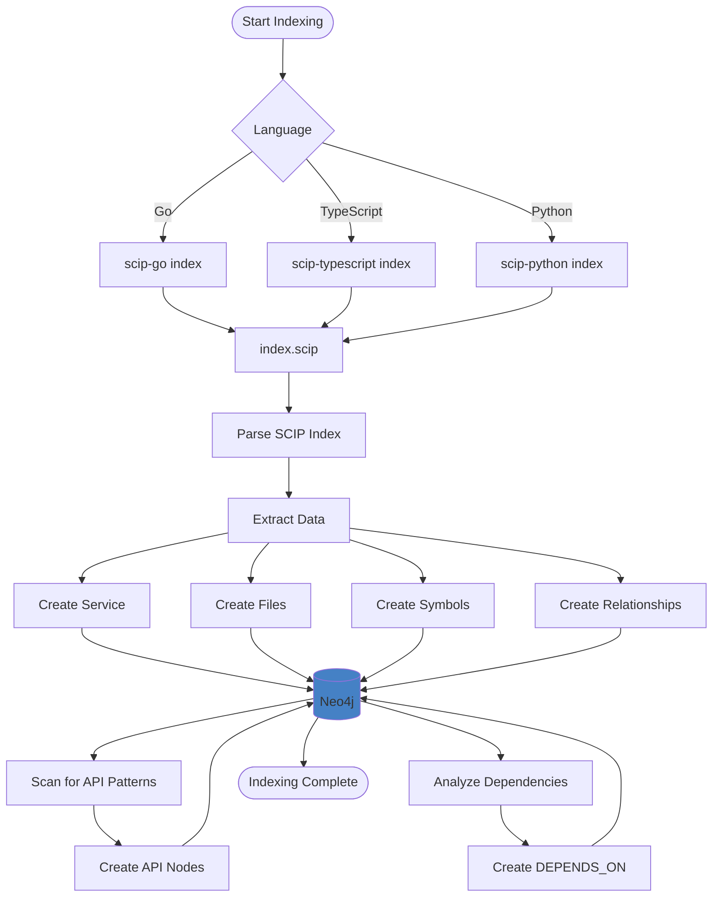

### Query Flow

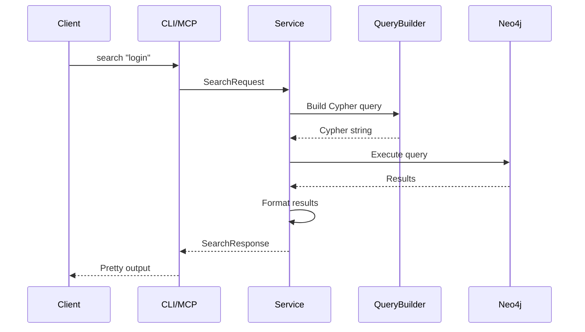

## Performance Considerations

### Batching Strategy

```go
// Batch operations for better performance
func (client *Client) BatchCreateNodes(nodes []Node) error {
    query := `
        UNWIND $batch AS node
        MERGE (n:Node {id: node.id})
        SET n += node.properties
    `
    return client.ExecuteQuery(ctx, query, map[string]any{
        "batch": nodes,
    })
}
```

### Connection Pooling

```go
// Neo4j driver with connection pooling
driver, err := neo4j.NewDriverWithContext(
    uri,
    neo4j.BasicAuth(username, password, ""),
    func(config *neo4j.Config) {
        config.MaxConnectionPoolSize = 50
        config.MaxConnectionLifetime = 1 * time.Hour
        config.ConnectionAcquisitionTimeout = 2 * time.Minute
    },
)
```

### Query Optimization

```cypher
// Use query hints for better performance
MATCH (s:Service {name: $serviceName})
USING INDEX s:Service(name)
MATCH (s)-[:CONTAINS*]->(f:Function)
WHERE f.name CONTAINS $searchTerm
RETURN f
LIMIT 100
```

## Scalability

### Horizontal Scaling (Planned)

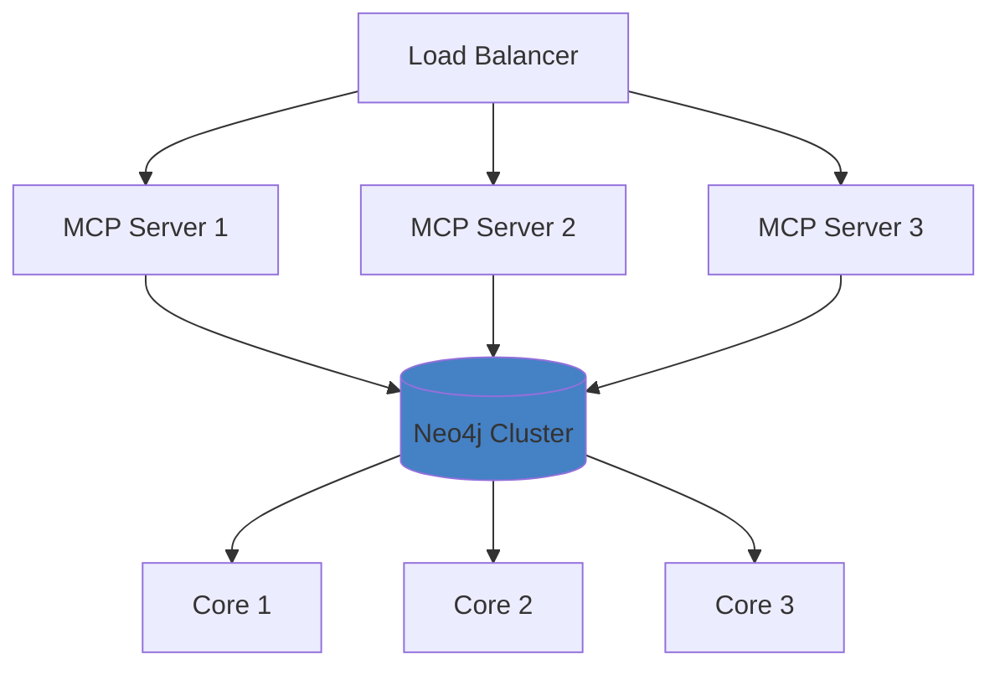

### Caching Strategy (Planned)

```go
type QueryCache struct {
    cache *lru.Cache
    ttl   time.Duration
}

func (qc *QueryCache) Get(query string) (interface{}, bool) {
    return qc.cache.Get(query)
}

func (qc *QueryCache) Set(query string, result interface{}) {
    qc.cache.Add(query, result)
}
```

## Next Steps

- **[Graph Schema](03-graph-schema.md)** - Detailed schema design
- **[Indexing Guide](04-indexing.md)** - Indexing workflows
- **[CLI Reference](05-cli-reference.md)** - Command reference
