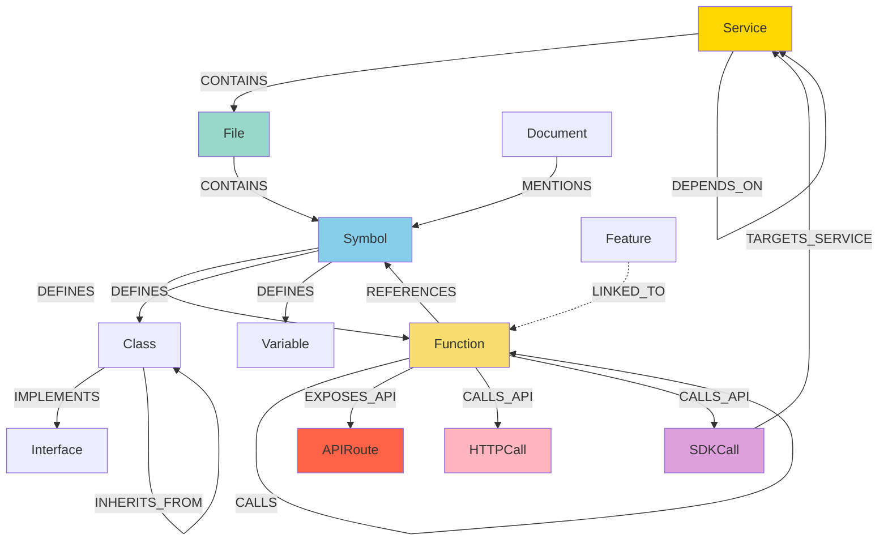

# CodeGraph Graph Schema

## Overview

CodeGraph uses a **Code Property Graph (CPG)** model stored in Neo4j. The schema is designed to capture both structural (AST-like) and semantic (cross-cutting) relationships.

## Schema Diagram



## Node Types

### 1. Service Node

Represents a microservice, application, or package.

```cypher
CREATE (s:Service {
    name: "payment-service",
    packageName: "@company/payment-api",
    version: "v2.1.0",
    language: "typescript",
    repositoryURL: "https://github.com/company/payment-service",
    indexed_at: datetime()
})
```

**Properties:**
| Property | Type | Description | Required |
|----------|------|-------------|----------|
| name | String | Service name | ✅ |
| packageName | String | NPM/Maven package name | ❌ |
| version | String | Semantic version | ❌ |
| language | String | Primary language (go, typescript, etc.) | ✅ |
| repositoryURL | String | Git repository URL | ❌ |
| indexed_at | DateTime | When last indexed | ✅ |

### 2. File Node

Represents a source code file.

```cypher
CREATE (f:File {
    path: "src/handlers/payment.ts",
    serviceName: "payment-service",
    language: "typescript",
    lines: 245,
    size: 8192
})
```

**Properties:**
| Property | Type | Description |
|----------|------|-------------|
| path | String | Relative file path |
| serviceName | String | Parent service name |
| language | String | File language |
| lines | Integer | Line count |
| size | Integer | File size in bytes |

### 3. Symbol Node

Canonical symbol definition using SCIP format.

```cypher
CREATE (sym:Symbol {
    scipSymbol: "scip-typescript npm @company/payment-api v2.1.0 src/handlers/payment.ts/processPayment().",
    name: "processPayment",
    kind: "function",
    filePath: "src/handlers/payment.ts",
    startLine: 42,
    endLine: 85,
    signature: "function processPayment(orderId: string): Promise<PaymentResult>"
})
```

**SCIP Symbol Format:**
```
scip-<language> <manager> <package> <version> <file>/<symbol>
```

**Properties:**
| Property | Type | Description |
|----------|------|-------------|
| scipSymbol | String | Unique SCIP identifier |
| name | String | Symbol name |
| kind | String | function, class, variable, etc. |
| filePath | String | Defining file path |
| startLine | Integer | Start line number |
| endLine | Integer | End line number |
| signature | String | Full signature |

### 4. Function Node

Executable code unit (function or method).

```cypher
CREATE (f:Function {
    name: "processPayment",
    signature: "function processPayment(orderId: string): Promise<PaymentResult>",
    file: "src/handlers/payment.ts",
    startLine: 42,
    endLine: 85,
    complexity: 8,
    parameters: ["orderId"],
    returnType: "Promise<PaymentResult>"
})
```

**Properties:**
| Property | Type | Description |
|----------|------|-------------|
| name | String | Function name |
| signature | String | Full signature |
| file | String | File path |
| startLine | Integer | Start line |
| endLine | Integer | End line |
| complexity | Integer | Cyclomatic complexity |
| parameters | Array[String] | Parameter names |
| returnType | String | Return type |

### 5. Class Node

Class or struct definition.

```cypher
CREATE (c:Class {
    name: "PaymentProcessor",
    file: "src/handlers/payment.ts",
    startLine: 10,
    endLine: 150,
    methods: ["process", "validate", "refund"],
    properties: ["config", "client"]
})
```

### 6. APIRoute Node

API endpoint definition.

```cypher
CREATE (api:APIRoute {
    method: "POST",
    endpoint: "/api/v1/payments",
    line: 42,
    framework: "express"
})
```

**Properties:**
| Property | Type | Description |
|----------|------|-------------|
| method | String | HTTP method (GET, POST, etc.) |
| endpoint | String | URL path |
| line | Integer | Line number in file |
| framework | String | API framework (express, elysia, etc.) |

### 7. HTTPCall Node

HTTP request made by code.

```cypher
CREATE (http:HTTPCall {
    method: "GET",
    url: "https://api.stripe.com/v1/charges",
    line: 58
})
```

### 8. SDKCall Node

SDK method invocation.

```cypher
CREATE (sdk:SDKCall {
    target: "stripeClient.createCharge",
    line: 62
})
```

### 9. Document Node

Business or technical document.

```cypher
CREATE (doc:Document {
    fileName: "payment-api-spec.md",
    path: "docs/apis/payment.md",
    title: "Payment API Specification",
    content: "...",
    type: "markdown",
    indexed_at: datetime()
})
```

### 10. Feature Node

Business feature or requirement.

```cypher
CREATE (feat:Feature {
    name: "Payment Processing",
    description: "Process credit card payments securely",
    priority: "high",
    status: "implemented"
})
```

## Relationship Types

### 1. CONTAINS

Structural hierarchy relationship.

```cypher
// Service contains Files
(Service)-[:CONTAINS]->(File)

// File contains Symbols
(File)-[:CONTAINS]->(Symbol)

// Symbol defines Functions/Classes
(Symbol)-[:DEFINES]->(Function)
(Symbol)-[:DEFINES]->(Class)
```

**Properties:**
| Property | Type | Description |
|----------|------|-------------|
| (none) | - | Pure structural relationship |

### 2. CALLS

Function invocation relationship.

```cypher
(Function)-[:CALLS {
    line: 45,
    column: 12
}]->(Function)
```

**Properties:**
| Property | Type | Description |
|----------|------|-------------|
| line | Integer | Call site line number |
| column | Integer | Call site column |

### 3. REFERENCES

Symbol usage relationship.

```cypher
(Function)-[:REFERENCES {
    line: 52,
    kind: "read"
}]->(Symbol)
```

**Properties:**
| Property | Type | Description |
|----------|------|-------------|
| line | Integer | Reference line |
| kind | String | read, write, or both |

### 4. EXPOSES_API

Function exposes an API endpoint.

```cypher
(Function)-[:EXPOSES_API]->(APIRoute)
```

### 5. CALLS_API

Function makes an API call.

```cypher
(Function)-[:CALLS_API]->(HTTPCall)
(Function)-[:CALLS_API]->(SDKCall)
```

### 6. TARGETS_SERVICE

SDK call targets a specific service.

```cypher
(SDKCall)-[:TARGETS_SERVICE]->(Service)
```

### 7. DEPENDS_ON

Service dependency relationship.

```cypher
(Service)-[:DEPENDS_ON {
    packageName: "@company/auth-sdk",
    importCount: 15
}]->(Service)
```

**Properties:**
| Property | Type | Description |
|----------|------|-------------|
| packageName | String | Imported package name |
| importCount | Integer | Number of imports |

### 8. IMPLEMENTS / INHERITS_FROM

OOP relationships.

```cypher
(Class)-[:IMPLEMENTS]->(Interface)
(Class)-[:INHERITS_FROM]->(Class)
```

### 9. MENTIONS

Document mentions a code symbol.

```cypher
(Document)-[:MENTIONS {
    confidence: 0.95,
    context: "The processPayment function..."
}]->(Symbol)
```

**Properties:**
| Property | Type | Description |
|----------|------|-------------|
| confidence | Float | LLM confidence score |
| context | String | Surrounding text |

### 10. LINKED_TO

Feature linked to implementation.

```cypher
(Feature)-[:LINKED_TO {
    linkType: "implements",
    confidence: 0.92
}]->(Function)
```

## Schema Constraints

### Uniqueness Constraints

```cypher
// Service names must be unique
CREATE CONSTRAINT service_name_unique IF NOT EXISTS
FOR (s:Service) REQUIRE s.name IS UNIQUE;

// SCIP symbols must be unique
CREATE CONSTRAINT symbol_scip_unique IF NOT EXISTS
FOR (s:Symbol) REQUIRE s.scipSymbol IS UNIQUE;

// File paths must be unique per service
CREATE CONSTRAINT file_path_unique IF NOT EXISTS
FOR (f:File) REQUIRE (f.serviceName, f.path) IS NODE KEY;

// API routes must be unique per service
CREATE CONSTRAINT api_route_unique IF NOT EXISTS
FOR (api:APIRoute) REQUIRE (api.method, api.endpoint) IS NODE KEY;
```

### Property Existence Constraints

```cypher
// Services must have name and language
CREATE CONSTRAINT service_required_properties IF NOT EXISTS
FOR (s:Service) REQUIRE s.name IS NOT NULL;

CREATE CONSTRAINT service_language IF NOT EXISTS
FOR (s:Service) REQUIRE s.language IS NOT NULL;
```

## Indexes

### Property Indexes

```cypher
// Function name index
CREATE INDEX function_name_idx IF NOT EXISTS
FOR (f:Function) ON (f.name);

// Symbol kind index
CREATE INDEX symbol_kind_idx IF NOT EXISTS
FOR (s:Symbol) ON (s.kind);

// File path index
CREATE INDEX file_path_idx IF NOT EXISTS
FOR (f:File) ON (f.path);
```

### Full-text Indexes

```cypher
// Symbol name search
CREATE FULLTEXT INDEX symbolNameIndex IF NOT EXISTS
FOR (s:Symbol) ON EACH [s.name, s.signature];

// Function search
CREATE FULLTEXT INDEX functionNameIndex IF NOT EXISTS
FOR (f:Function) ON EACH [f.name, f.signature];

// Document search
CREATE FULLTEXT INDEX documentContentIndex IF NOT EXISTS
FOR (d:Document) ON EACH [d.title, d.content];
```

### Vector Indexes (for embeddings)

```cypher
// Comment embeddings
CREATE VECTOR INDEX commentEmbeddingIndex IF NOT EXISTS
FOR (c:Comment) ON (c.embedding)
OPTIONS {indexConfig: {
    `vector.dimensions`: 768,
    `vector.similarity_function`: 'cosine'
}};

// Document chunk embeddings
CREATE VECTOR INDEX documentChunkEmbeddingIndex IF NOT EXISTS
FOR (dc:DocumentChunk) ON (dc.embedding)
OPTIONS {indexConfig: {
    `vector.dimensions`: 768,
    `vector.similarity_function`: 'cosine'
}};
```

## Example Queries

### Find All Functions in a Service

```cypher
MATCH (s:Service {name: 'payment-service'})
MATCH (s)-[:CONTAINS*]->(f:Function)
RETURN f.name, f.signature, f.file
ORDER BY f.name;
```

### Find API Endpoints and Their Handlers

```cypher
MATCH (api:APIRoute)<-[:EXPOSES_API]-(f:Function)
WHERE f.file STARTS WITH 'src/handlers'
RETURN api.method, api.endpoint, f.name, f.file
ORDER BY api.endpoint;
```

### Find Cross-Service Call Chains

```cypher
MATCH (s1:Service {name: 'frontend'})-[:CONTAINS*]->(f1:Function)
MATCH (s2:Service {name: 'backend'})-[:CONTAINS*]->(f2:Function)
MATCH path = shortestPath((f1)-[:CALLS*..10]-(f2))
RETURN path
LIMIT 5;
```

### Find All Dependencies of a Service

```cypher
MATCH (s:Service {name: 'payment-service'})-[d:DEPENDS_ON]->(dep:Service)
RETURN dep.name, dep.packageName, d.importCount
ORDER BY d.importCount DESC;
```

### Find Functions That Call an API

```cypher
MATCH (f:Function)-[:CALLS_API]->(http:HTTPCall)
WHERE http.url CONTAINS 'stripe.com'
RETURN f.name, f.file, http.method, http.url;
```

### Find All Code Implementing a Feature

```cypher
MATCH (feat:Feature {name: 'Payment Processing'})-[:LINKED_TO]->(f:Function)
RETURN f.name, f.signature, f.file;
```

## Schema Evolution

### Adding New Node Types

```go
// 1. Add to pkg/models/node.go
type NewNodeType struct {
    ID         string
    Property1  string
    Property2  int
}

// 2. Create in Neo4j
func (c *Client) CreateNewNode(node *NewNodeType) error {
    query := `
        CREATE (n:NewNodeType {
            id: $id,
            property1: $property1,
            property2: $property2
        })
    `
    return c.ExecuteQuery(ctx, query, node)
}

// 3. Add constraints/indexes in pkg/schema/schema.go
func (sm *SchemaManager) createNewNodeConstraints() error {
    return sm.createConstraint(
        "CREATE CONSTRAINT new_node_id IF NOT EXISTS " +
        "FOR (n:NewNodeType) REQUIRE n.id IS UNIQUE"
    )
}
```

### Schema Migration

```cypher
// Example: Add new property to existing nodes
MATCH (f:Function)
WHERE NOT EXISTS(f.complexity)
SET f.complexity = 0;

// Example: Rename property
MATCH (f:Function)
WHERE EXISTS(f.old_property)
SET f.new_property = f.old_property
REMOVE f.old_property;
```

## Best Practices

### 1. Use Batching for Bulk Operations

```go
// Bad: One-by-one
for _, node := range nodes {
    client.CreateNode(node)
}

// Good: Batch operation
client.BatchCreateNodes(nodes)
```

### 2. Use Parameters in Queries

```cypher
// Bad: String interpolation
MATCH (f:Function {name: 'processPayment'})

// Good: Parameters
MATCH (f:Function {name: $functionName})
```

### 3. Limit Result Sets

```cypher
// Always use LIMIT for large result sets
MATCH (f:Function)
WHERE f.name CONTAINS $searchTerm
RETURN f
LIMIT 100;
```

### 4. Use Indexes for Lookups

```cypher
// Ensure index exists and is used
MATCH (s:Service {name: $serviceName})
USING INDEX s:Service(name)
MATCH (s)-[:CONTAINS*]->(f:Function)
RETURN f;
```

## Next Steps

- **[Indexing Guide](04-indexing.md)** - How to populate the graph
- **[CLI Reference](05-cli-reference.md)** - Using the CLI
- **[MCP Reference](06-mcp-reference.md)** - AI assistant integration
