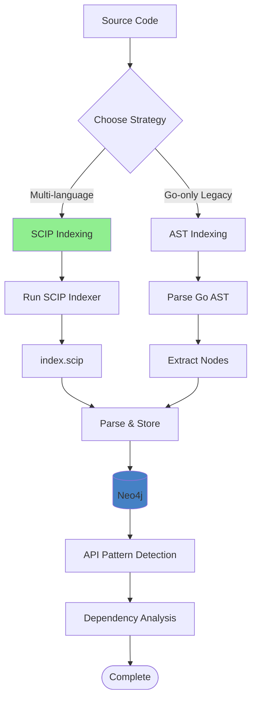
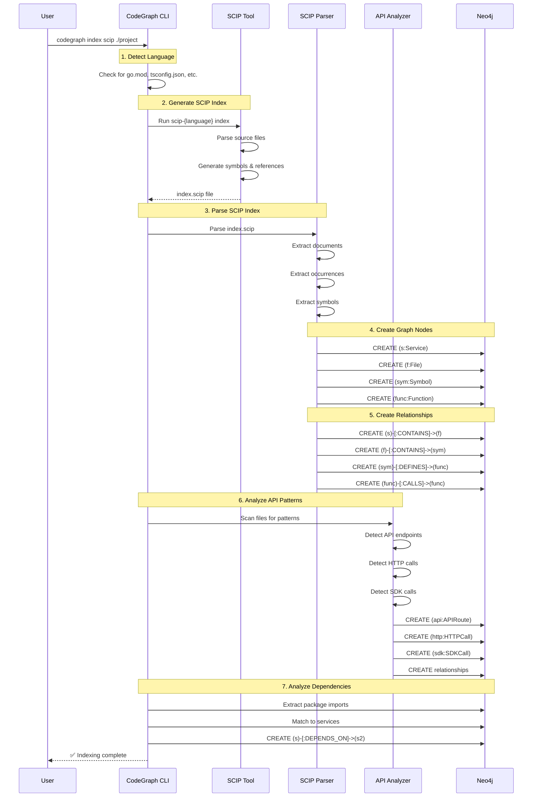
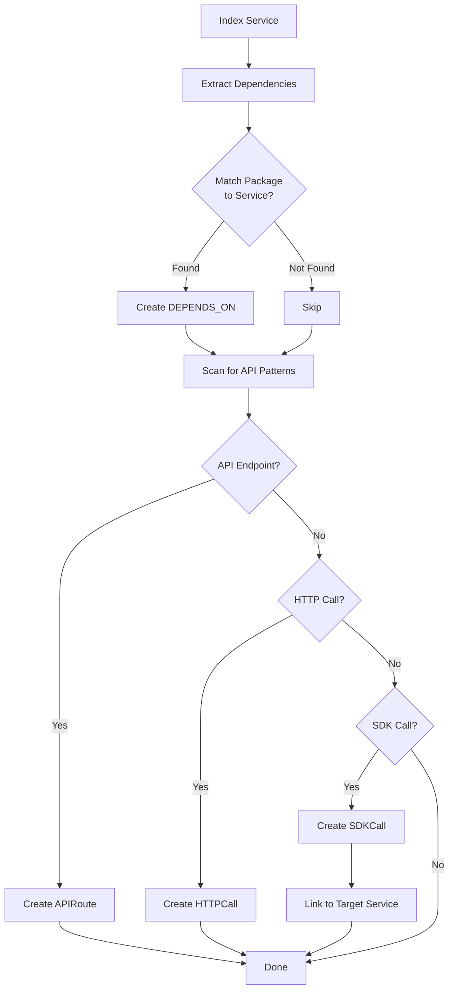
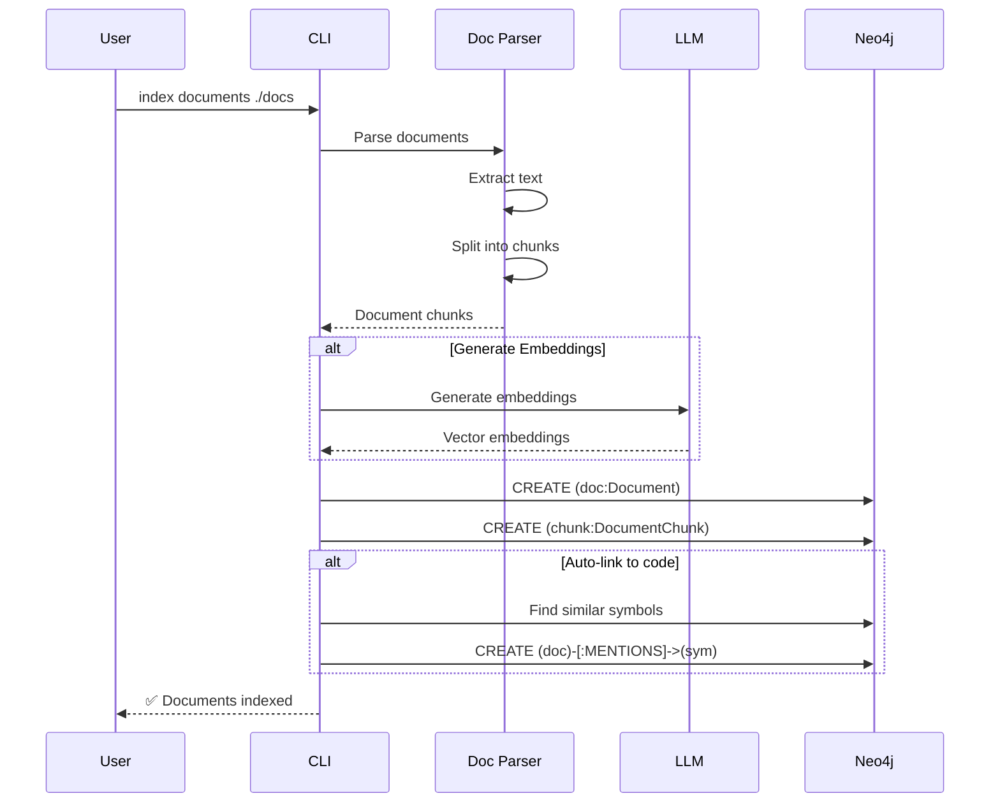
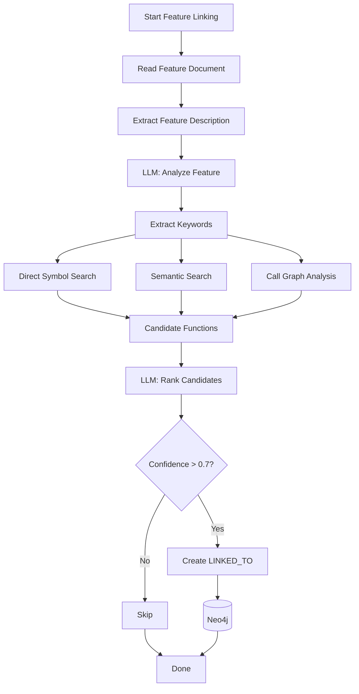
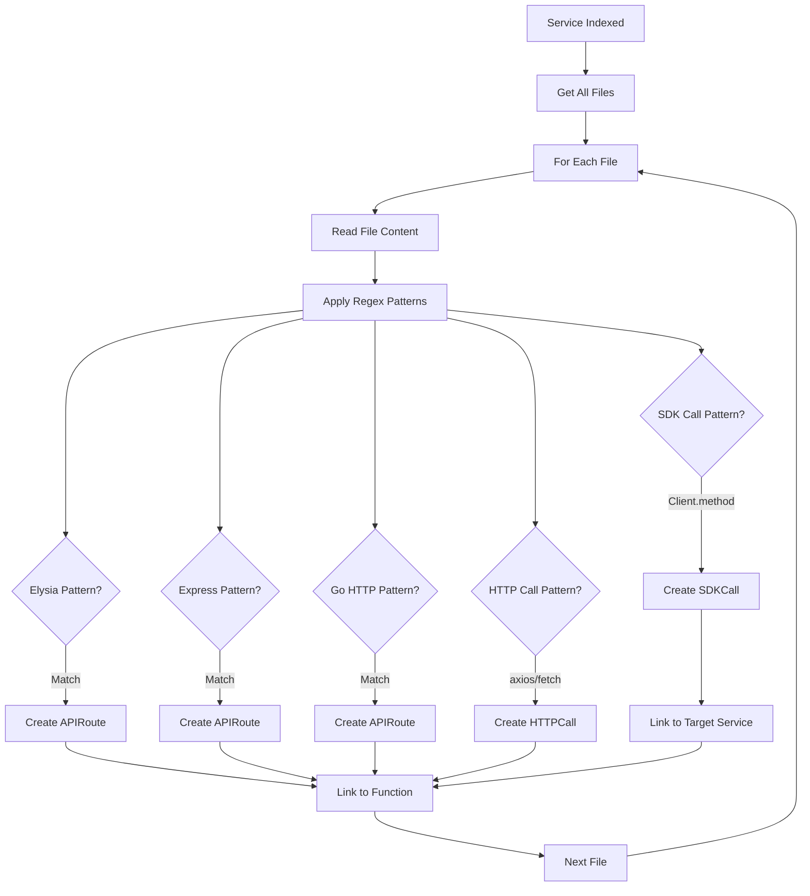

# CodeGraph Indexing Guide

## Overview

Indexing is the process of transforming source code into a queryable graph structure in Neo4j. CodeGraph supports multiple indexing strategies for different use cases.

## Indexing Strategies



## SCIP Indexing (Recommended)

SCIP (Source Code Intelligence Protocol) provides precise, cross-language code intelligence.

### Prerequisites

Install the appropriate SCIP indexer for your language:

```bash
# Go
go install github.com/sourcegraph/scip-go/cmd/scip-go@latest

# TypeScript/JavaScript
npm install -g @sourcegraph/scip-typescript

# Python
pip install scip-python

# Java/Scala/Kotlin
# See https://sourcegraph.github.io/scip-java/
```

### Basic Usage

```bash
# Auto-detect language and index
codegraph index scip /path/to/project --service="my-service"

# Explicitly specify language
codegraph index scip ./frontend --language=typescript --service="web-app"

# With version and repository URL
codegraph index scip . --service="api" --version="v2.1.0" --repo-url="https://github.com/company/api"
```

### Indexing Workflow



### Language-Specific Configuration

#### Go

```bash
# Simple index
codegraph index scip . --language=go --service="backend"

# SCIP-go uses go.mod for package info
# Ensure your module is properly configured:
# go mod tidy
```

#### TypeScript/JavaScript

```bash
# TypeScript project
codegraph index scip ./src --language=typescript --service="frontend"

# Ensure tsconfig.json exists
# scip-typescript uses it for type information
```

#### Python

```bash
# Python project
codegraph index scip ./app --language=python --service="ml-service"

# Works with requirements.txt, setup.py, or pyproject.toml
```

## Microservice Indexing

### Monorepo Structure

For a monorepo with multiple services:

```
monorepo/
├── services/
│   ├── auth/          (Go)
│   ├── api/           (TypeScript)
│   └── ml/            (Python)
└── packages/
    ├── shared-ui/     (TypeScript)
    └── common/        (Go)
```

Index each service separately:

```bash
# Index Auth Service
codegraph index scip ./services/auth \
  --service="auth-service" \
  --language=go \
  --version="v1.2.0"

# Index API Service
codegraph index scip ./services/api \
  --service="api-service" \
  --language=typescript \
  --version="v2.0.1"

# Index ML Service
codegraph index scip ./services/ml \
  --service="ml-service" \
  --language=python \
  --version="v0.5.0"

# Index Shared Packages
codegraph index scip ./packages/shared-ui \
  --service="shared-ui" \
  --language=typescript

codegraph index scip ./packages/common \
  --service="common" \
  --language=go
```

### Cross-Service Linking

CodeGraph automatically detects cross-service relationships:



**Example:**

```typescript
// services/api/src/handlers/user.ts
import { AuthClient } from '@company/auth-sdk';

const authClient = new AuthClient();

export async function validateUser(token: string) {
  // SDK Call - CodeGraph detects this and creates:
  // (SDKCall)-[:TARGETS_SERVICE]->(auth-service)
  return await authClient.validateToken(token);
}
```

## Document Indexing

Index business documents and link them to code:

```bash
# Index a single document
codegraph index documents ./docs/api-spec.md --service="api-service"

# Index a directory of documents
codegraph index documents ./docs --service="api-service"

# With embedding generation for semantic search
codegraph index documents ./docs --generate-embeddings
```

### Document Indexing Flow



### Supported Document Formats

- **Markdown** (`.md`)
- **PDF** (`.pdf`)
- **Plain text** (`.txt`)

## Feature Linking

Link feature descriptions to code implementation using LLMs:

```bash
# Link a feature document
codegraph link features ./docs/features/payment-processing.md

# Batch link multiple features
codegraph link features ./docs/features/*.md

# Use specific LLM provider
codegraph link features ./docs/features/auth.md --provider=litellm
```

### Feature Linking Flow



## API Pattern Detection

Automatically detect API endpoints and HTTP calls:



### Detected Patterns

#### API Endpoints

```typescript
// Elysia
app.get('/api/users', async () => { /* ... */ });
// Creates: (APIRoute {method: "GET", endpoint: "/api/users"})

// Express
app.post('/api/login', async (req, res) => { /* ... */ });
// Creates: (APIRoute {method: "POST", endpoint: "/api/login"})
```

```go
// Go HTTP
http.HandleFunc("/api/status", handleStatus)
// Creates: (APIRoute {method: "GET", endpoint: "/api/status"})
```

#### HTTP Calls

```typescript
// Axios
const result = await axios.get('https://api.example.com/data');
// Creates: (HTTPCall {method: "GET", url: "https://api.example.com/data"})

// Fetch
const response = await fetch('https://api.example.com/users');
// Creates: (HTTPCall {method: "GET", url: "https://api.example.com/users"})
```

#### SDK Calls

```typescript
// SDK method call
const user = await authClient.getUser(userId);
// Creates: (SDKCall {target: "authClient.getUser"})
//          (SDKCall)-[:TARGETS_SERVICE]->(auth-service)
```

## Incremental Indexing (Planned)

Future support for incremental updates:

```bash
# Watch for changes and incrementally update
codegraph index watch ./project --service="api"

# Re-index only changed files
codegraph index incremental ./project --service="api"
```

## Performance Tips

### 1. Batch Index Multiple Services

```bash
#!/bin/bash
# index-all.sh

services=(
  "auth:./services/auth:go"
  "api:./services/api:typescript"
  "ml:./services/ml:python"
)

for service in "${services[@]}"; do
  IFS=: read -r name path lang <<< "$service"
  echo "Indexing $name..."
  codegraph index scip "$path" --service="$name" --language="$lang"
done
```

### 2. Use Parallel Indexing

```bash
# Index services in parallel
codegraph index scip ./auth --service="auth" &
codegraph index scip ./api --service="api" &
codegraph index scip ./ml --service="ml" &
wait
```

### 3. Skip API Detection for Large Codebases

```bash
# Skip API pattern detection (faster)
codegraph index scip ./project --service="huge-service" --skip-api-detection
```

## Troubleshooting

### Issue: SCIP indexer not found

```bash
# Verify SCIP indexer is installed
which scip-go
which scip-typescript
which scip-python

# If not found, install it
go install github.com/sourcegraph/scip-go/cmd/scip-go@latest
```

### Issue: Index file not generated

```bash
# Check project structure
ls -la index.scip

# Manually run SCIP indexer
scip-go index

# Check for errors
echo $?
```

### Issue: Services not linked

```bash
# Verify package names match
# Check package.json, go.mod for exact package names

# Re-index with verbose logging
codegraph index scip ./project --service="api" --verbose
```

## Next Steps

- **[CLI Reference](05-cli-reference.md)** - Complete command reference
- **[MCP Reference](06-mcp-reference.md)** - AI assistant integration
- **[Installation](07-installation.md)** - Setup and configuration
