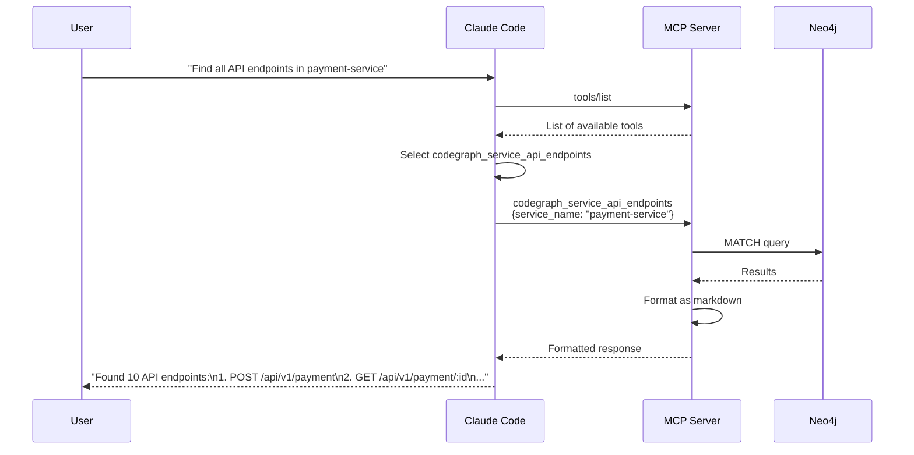

# CodeGraph MCP Server Reference

## Overview

The CodeGraph MCP (Model Context Protocol) server exposes code intelligence tools to AI assistants like Claude Code. It provides seamless integration for AI-powered code exploration and analysis.

## Architecture



## Setup

### Installation

```bash
# Using the one-command installer (recommended)
curl -fsSL https://raw.githubusercontent.com/techsavvyash/codegraph/master/scripts/install.sh | bash

# Or manual setup
cd mcp-server
go build -o codegraph-mcp .
```

### Claude Code Integration

```bash
# Add to Claude Code
claude mcp add codegraph \
  ~/.codegraph/mcp-server/codegraph-mcp \
  NEO4J_URI=bolt://localhost:7687 \
  NEO4J_USERNAME=neo4j \
  NEO4J_PASSWORD=password123
```

### Manual Configuration

Edit `~/.config/Claude/claude_desktop_config.json`:

```json
{
  "mcpServers": {
    "codegraph": {
      "command": "/Users/you/.codegraph/mcp-server/codegraph-mcp",
      "env": {
        "NEO4J_URI": "bolt://localhost:7687",
        "NEO4J_USERNAME": "neo4j",
        "NEO4J_PASSWORD": "password123"
      }
    }
  }
}
```

Restart Claude Code after configuration.

## Available Tools

The MCP server provides 12 tools organized into three categories:

### Code Intelligence Tools

#### codegraph_search

Search for symbols across the codebase.

**Parameters:**
```json
{
  "query": "string (required)",
  "limit": "number (optional, default: 10)",
  "service_name": "string (optional)"
}
```

**Example Usage:**
```
User: "Find all functions named 'process' in the payment service"
Claude uses: codegraph_search
  query: "process"
  limit: 20
  service_name: "payment-service"
```

**Response:**
```markdown
# Search Results for "process"

## Symbol Matches (12)

### processPayment
- **Type**: function
- **File**: src/handlers/payment.ts:42-85
- **Signature**: `function processPayment(orderId: string): Promise<PaymentResult>`
- **Service**: payment-service

### processRefund
- **Type**: function
- **File**: src/handlers/refund.ts:15-45
...
```

#### codegraph_get_source

Get source code for a specific function.

**Parameters:**
```json
{
  "function_name": "string (required)"
}
```

**Example Usage:**
```
User: "Show me the code for processPayment"
Claude uses: codegraph_get_source
  function_name: "processPayment"
```

**Response:**
```markdown
# Function Source: processPayment

**File**: src/handlers/payment.ts
**Lines**: 42-85

\`\`\`typescript
async function processPayment(orderId: string): Promise<PaymentResult> {
  const order = await getOrder(orderId);
  
  // Validate order
  if (!order.isValid()) {
    throw new Error('Invalid order');
  }
  
  // Process with Stripe
  const payment = await stripe.createCharge({
    amount: order.total,
    currency: 'usd',
  });
  
  return {
    success: true,
    paymentId: payment.id,
  };
}
\`\`\`
```

#### codegraph_analyze_function

Analyze a function (callers, callees, complexity).

**Parameters:**
```json
{
  "function_name": "string (required)"
}
```

**Example Usage:**
```
User: "What functions call validateToken and what does it call?"
Claude uses: codegraph_analyze_function
  function_name: "validateToken"
```

**Response:**
```markdown
# Function Analysis: validateToken

**File**: src/auth/token.ts
**Lines**: 23-56
**Complexity**: 5

### Called By (3)
- **authenticateRequest** (src/middleware/auth.ts:12)
- **verifyUser** (src/handlers/user.ts:45)
- **refreshSession** (src/auth/session.ts:78)

### Calls (4)
- **parseToken** (src/auth/jwt.ts:15)
- **checkExpiration** (src/auth/jwt.ts:42)
- **verifySignature** (src/auth/jwt.ts:89)
- **getUserFromToken** (src/db/users.ts:123)
```

### Document Intelligence Tools

#### codegraph_index_documents

Index documents and link them to code.

**Parameters:**
```json
{
  "path": "string (required)",
  "service_name": "string (optional)",
  "generate_embeddings": "boolean (optional, default: false)"
}
```

**Example Usage:**
```
User: "Index the API documentation"
Claude uses: codegraph_index_documents
  path: "./docs/api"
  generate_embeddings: true
```

#### codegraph_show_document

Show document content with linked code.

**Parameters:**
```json
{
  "document_path": "string (required)"
}
```

**Example Usage:**
```
User: "Show me the payment API spec and what code implements it"
Claude uses: codegraph_show_document
  document_path: "docs/api/payment.md"
```

#### codegraph_link_features

Link feature descriptions to code using LLMs.

**Parameters:**
```json
{
  "document_path": "string (required)",
  "confidence_threshold": "number (optional, default: 0.7)"
}
```

**Example Usage:**
```
User: "Link the authentication feature doc to the code"
Claude uses: codegraph_link_features
  document_path: "docs/features/auth.md"
  confidence_threshold: 0.8
```

### Service Architecture Tools

#### codegraph_list_services

List all services with metadata.

**Parameters:**
```json
{}
```

**Example Usage:**
```
User: "What services are indexed in the codebase?"
Claude uses: codegraph_list_services
```

**Response:**
```markdown
# Services

## auth-service
- **Package**: @company/auth-api
- **Version**: v2.1.0
- **Language**: typescript
- **Files**: 45
- **Dependencies**: database-client, logger

## payment-service
- **Package**: @company/payment-api
- **Version**: v1.5.2
- **Language**: typescript
- **Files**: 38
- **Dependencies**: stripe-sdk, auth-sdk
...
```

#### codegraph_service_dependencies

Show service dependencies (DEPENDS_ON relationships).

**Parameters:**
```json
{
  "service_name": "string (required)"
}
```

**Example Usage:**
```
User: "What does the payment service depend on?"
Claude uses: codegraph_service_dependencies
  service_name: "payment-service"
```

**Response:**
```markdown
# Dependencies for payment-service

| Target Service | Package Name | Import Count | Imported Package |
|----------------|--------------|--------------|------------------|
| auth-service | @company/auth-sdk | 15 | @company/auth-sdk |
| database | @company/db-client | 8 | @company/db-client |
| logger | @company/logger | 42 | @company/logger |
```

#### codegraph_service_api_endpoints

List API endpoints exposed by a service.

**Parameters:**
```json
{
  "service_name": "string (required)"
}
```

**Example Usage:**
```
User: "List all API endpoints in the payment service"
Claude uses: codegraph_service_api_endpoints
  service_name: "payment-service"
```

**Response:**
```markdown
# API Endpoints for payment-service

| Method | Endpoint | Function | File |
|--------|----------|----------|------|
| POST | /api/v1/payment | processPayment | src/handlers/payment.ts |
| GET | /api/v1/payment/:id | getPayment | src/handlers/payment.ts |
| POST | /api/v1/refund | processRefund | src/handlers/refund.ts |
| PUT | /api/v1/payment/:id | updatePayment | src/handlers/payment.ts |
```

#### codegraph_service_api_calls

Show API calls made by a service.

**Parameters:**
```json
{
  "service_name": "string (required)"
}
```

**Example Usage:**
```
User: "What external APIs does the payment service call?"
Claude uses: codegraph_service_api_calls
  service_name: "payment-service"
```

**Response:**
```markdown
# API Calls from payment-service

| Type | Target | Method/SDK | URL/Call | Target Service | Function |
|------|--------|------------|----------|----------------|----------|
| SDK | stripeClient.createCharge | createCharge | - | stripe-service | processPayment |
| HTTP | https://api.stripe.com/v1/charges | POST | https://api.stripe.com/v1/charges | - | processPayment |
| SDK | authClient.validateToken | validateToken | - | auth-service | authenticateRequest |
```

#### codegraph_cross_service_calls

Find call chains between two services.

**Parameters:**
```json
{
  "source_service": "string (required)",
  "target_service": "string (required)"
}
```

**Example Usage:**
```
User: "How does the frontend call the database?"
Claude uses: codegraph_cross_service_calls
  source_service: "frontend"
  target_service: "database"
```

**Response:**
```markdown
# Call Chains: frontend → database

## Path 1 (length: 5)

frontend -[CONTAINS]→ UserComponent -[CALLS]→ apiClient.getUser -[CALLS_API]→ GET /api/users -[TARGETS_SERVICE]→ api-service -[CONTAINS]→ getUserHandler -[CALLS]→ db.query -[TARGETS_SERVICE]→ database

## Path 2 (length: 6)

frontend -[CONTAINS]→ AuthComponent -[CALLS]→ login -[CALLS_API]→ POST /api/auth/login -[TARGETS_SERVICE]→ auth-service -[CALLS]→ validateCredentials -[CALLS]→ db.findUser -[TARGETS_SERVICE]→ database
```

#### codegraph_service_architecture

Complete architecture overview with dependency graph.

**Parameters:**
```json
{}
```

**Example Usage:**
```
User: "Give me an overview of the entire system architecture"
Claude uses: codegraph_service_architecture
```

**Response:**
```markdown
# Service Architecture Overview

**Total Services**: 5

## frontend
- **Package**: @company/web-app
- **API Endpoints**: 0
- **API Calls**: 25
- **Dependencies**:
  - auth-service
  - api-service

## auth-service
- **Package**: @company/auth-api
- **API Endpoints**: 8
- **API Calls**: 12
- **Dependencies**:
  - database
  - redis

## api-service
- **Package**: @company/api-gateway
- **API Endpoints**: 45
- **API Calls**: 38
- **Dependencies**:
  - auth-service
  - payment-service
  - database

## payment-service
- **Package**: @company/payment-api
- **API Endpoints**: 6
- **API Calls**: 15
- **Dependencies**:
  - auth-service
  - stripe-sdk

## database
- **Package**: postgresql
- **API Endpoints**: 0
- **API Calls**: 0
- **Dependencies**: (none)

## Dependency Graph

\`\`\`mermaid
graph LR
    frontend --> auth-service
    frontend --> api-service
    auth-service --> database
    auth-service --> redis
    api-service --> auth-service
    api-service --> payment-service
    api-service --> database
    payment-service --> auth-service
    payment-service --> stripe-sdk
\`\`\`
```

## Usage Examples

### Example 1: Understanding a Feature

```
User: "I need to understand how user authentication works"

Claude: Let me explore the authentication system for you.

[Uses codegraph_search with query="authenticate"]
[Uses codegraph_analyze_function with function_name="authenticateUser"]
[Uses codegraph_service_dependencies with service_name="auth-service"]

Based on my analysis:

1. **Entry Point**: The `authenticateUser` function in `src/auth/handlers.ts`
2. **Flow**:
   - Validates credentials using `validateCredentials`
   - Generates JWT token with `generateToken`
   - Stores session in Redis
3. **Dependencies**: 
   - Uses `bcrypt` for password hashing
   - Uses `jsonwebtoken` for JWT
   - Calls `database` service for user lookup
4. **API Endpoints**:
   - POST /api/auth/login
   - POST /api/auth/refresh
   - POST /api/auth/logout
```

### Example 2: Impact Analysis

```
User: "If I change the processPayment function, what will break?"

Claude: Let me analyze the impact of changing `processPayment`.

[Uses codegraph_analyze_function with function_name="processPayment"]
[Uses codegraph_service_api_endpoints with service_name="payment-service"]

Impact Analysis:

**Direct Callers** (3 functions will need review):
1. `handlePaymentRequest` (src/routes/payment.ts)
2. `retryFailedPayment` (src/jobs/retry.ts)
3. `processRefund` (src/handlers/refund.ts)

**Exposed via API**:
- POST /api/v1/payment (called by frontend)

**Downstream Services**:
- Calls `stripe.createCharge` (external service)
- Calls `auth.validateToken` (auth-service)

**Recommendation**: Update all 3 callers and test the payment API endpoint.
```

### Example 3: Onboarding

```
User: "I'm new to this codebase. Show me the main services and how they interact"

Claude: I'll give you an overview of the system architecture.

[Uses codegraph_service_architecture]
[Uses codegraph_list_services]

Welcome! Here's an overview of the system:

**Services** (5 total):
1. **frontend** - React web application
2. **auth-service** - Handles authentication/authorization
3. **api-service** - Main API gateway
4. **payment-service** - Payment processing
5. **database** - PostgreSQL database

**Architecture Flow**:
```
frontend → api-service → payment-service → stripe
    ↓           ↓
auth-service → database
```

**Key Interactions**:
- Frontend calls API gateway for all operations
- All services authenticate via auth-service
- Payment service integrates with Stripe
- Database is accessed by auth and API services

Would you like me to dive deeper into any specific service?
```

## Best Practices

### 1. Use Specific Queries

```
❌ Bad: "Search for stuff"
✅ Good: "Find all functions related to payment processing in the payment-service"
```

### 2. Combine Tools

Claude can chain multiple tool calls:

```
"Analyze the authentication flow"
→ search for "authenticate"
→ analyze_function on each result
→ service_dependencies on auth-service
→ cross_service_calls between frontend and auth
```

### 3. Specify Context

```
❌ Bad: "Show me the code"
✅ Good: "Show me the processPayment function code"
```

## Troubleshooting

### MCP Server Not Found

```bash
# Verify MCP server is built
ls -la ~/.codegraph/mcp-server/codegraph-mcp

# Rebuild if needed
cd ~/.codegraph/mcp-server
go build -o codegraph-mcp .
```

### Connection Errors

```bash
# Check Neo4j is running
docker ps | grep neo4j

# Test connection
curl http://localhost:7474

# Verify credentials
echo $NEO4J_PASSWORD
```

### Tools Not Appearing in Claude

```bash
# Check Claude Code config
cat ~/.config/Claude/claude_desktop_config.json

# Restart Claude Code
# (completely quit and reopen)
```

## Next Steps

- **[Installation Guide](07-installation.md)** - Setup instructions
- **[CLI Reference](05-cli-reference.md)** - CLI commands
