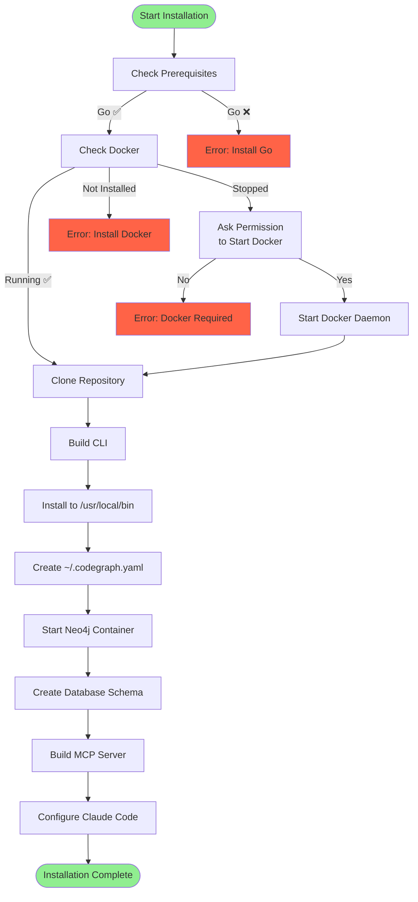

# CodeGraph Installation Guide

## Quick Start

The fastest way to install CodeGraph:

```bash
curl -fsSL https://raw.githubusercontent.com/techsavvyash/codegraph/master/install.sh | bash
```

This one-command installer will:
- ✅ Check prerequisites (Go, Docker)
- ✅ Build the CodeGraph CLI
- ✅ Start Neo4j database with Docker
- ✅ Create database schema
- ✅ Generate default configuration (`~/.codegraph.yaml`)
- ✅ Build and configure the MCP server for Claude Code
- ✅ Set up everything so you can start indexing immediately

## Prerequisites

### Required

- **Go 1.24+**
  ```bash
  # Check version
  go version
  
  # Install from https://go.dev/dl/
  ```

- **Docker & Docker Compose**
  ```bash
  # Check Docker
  docker --version
  docker-compose --version
  
  # Install from https://docker.com/get-started
  ```

### Optional (for multi-language support)

- **SCIP Indexers**
  ```bash
  # Go
  go install github.com/sourcegraph/scip-go/cmd/scip-go@latest
  
  # TypeScript/JavaScript
  npm install -g @sourcegraph/scip-typescript
  
  # Python
  pip install scip-python
  
  # Java/Scala/Kotlin
  # See https://sourcegraph.github.io/scip-java/
  ```

## Installation Methods

### Method 1: Automated Installer (Recommended)

#### Download and Run

```bash
# One command - installs everything
curl -fsSL https://raw.githubusercontent.com/techsavvyash/codegraph/master/install.sh | bash
```

#### What It Does



#### Customize Installation

```bash
# Custom installation directory (default: ~/.codegraph)
export CODEGRAPH_INSTALL_DIR="/opt/codegraph"

# Custom binary directory (default: /usr/local/bin)
export CODEGRAPH_BIN_DIR="$HOME/bin"

# Custom Neo4j password (default: password123)
export CODEGRAPH_NEO4J_PASSWORD="your-secure-password"

# Run installer with custom settings
./install.sh
```

#### Post-Installation

```bash
# Verify installation
codegraph --version
codegraph status

# Index your first project
codegraph index scip ./my-project --service="my-service"

# Use with Claude Code (already configured!)
# Just ask Claude to search your codebase
```

### Method 2: Manual Installation

For more control over the installation process:

#### 1. Clone Repository

```bash
git clone https://github.com/techsavvyash/codegraph.git
cd codegraph
```

#### 2. Build CLI

```bash
# Build CLI binary
make build

# Or manually
go build -o bin/codegraph ./cmd/codegraph

# Install to system PATH
sudo cp bin/codegraph /usr/local/bin/
# OR add to PATH
export PATH="$PWD/bin:$PATH"
```

#### 3. Start Neo4j

```bash
# Using docker-compose
docker-compose up -d

# Wait for Neo4j to be ready (30 seconds)
# Check status
docker ps | grep neo4j

# Verify Neo4j is accessible
curl http://localhost:7474
```

#### 4. Create Database Schema

```bash
# Create all constraints and indexes
codegraph schema create

# Verify schema
codegraph schema info
```

#### 5. Create Configuration

```bash
# Create config file
cat > ~/.codegraph.yaml << EOF
neo4j:
  uri: "bolt://localhost:7687"
  username: "neo4j"
  password: "password123"
  database: "neo4j"

verbose: false
EOF
```

#### 6. Build MCP Server (Optional)

```bash
# Build MCP server
cd mcp-server
go build -o codegraph-mcp .

# Add to Claude Code
claude mcp add codegraph \
  $PWD/codegraph-mcp \
  NEO4J_URI=bolt://localhost:7687 \
  NEO4J_USERNAME=neo4j \
  NEO4J_PASSWORD=password123
```

### Method 3: Development Setup

For contributors and developers:

```bash
# Clone repository
git clone https://github.com/techsavvyash/codegraph.git
cd codegraph

# Complete development setup (starts Neo4j, installs deps, creates schema)
make dev-setup

# Build and index this project
make dev

# Run tests
make test
make test-integration

# Build both CLI and MCP server
make build
make build-mcp
```

## Directory Structure

After installation, your directory structure will be:

```
~/.codegraph/
├── bin/
│   └── codegraph           # CLI binary (if installed locally)
├── mcp-server/
│   ├── codegraph-mcp       # MCP server binary
│   ├── main.go
│   └── ...
├── pkg/
│   ├── indexer/
│   ├── neo4j/
│   ├── query/
│   └── ...
├── docker-compose.yml      # Neo4j configuration
├── Makefile
└── README.md

~/.codegraph.yaml            # Configuration file
/usr/local/bin/codegraph     # CLI (system-wide install)
```

## Configuration

### Neo4j Configuration

Edit `docker-compose.yml` for Neo4j settings:

```yaml
version: '3.8'

services:
  neo4j:
    image: neo4j:5.15-community
    ports:
      - "7474:7474"  # HTTP (Browser)
      - "7687:7687"  # Bolt (Driver)
    environment:
      # Authentication
      - NEO4J_AUTH=neo4j/password123
      
      # Plugins
      - NEO4J_PLUGINS=["apoc","apoc-extended"]
      
      # Memory settings (adjust for your system)
      - NEO4J_server_memory_heap_initial__size=256m
      - NEO4J_server_memory_heap_max__size=1g
      - NEO4J_server_memory_pagecache_size=512m
      
      # Connection tuning
      - NEO4J_dbms_connector_bolt_thread__pool__max__size=20
      - NEO4J_dbms_connector_bolt_thread__pool__min__size=5
      
    volumes:
      - neo4j_data:/data
      - neo4j_logs:/logs

volumes:
  neo4j_data:
  neo4j_logs:
```

### CodeGraph Configuration

Edit `~/.codegraph.yaml`:

```yaml
# Neo4j Connection
neo4j:
  uri: "bolt://localhost:7687"
  username: "neo4j"
  password: "password123"
  database: "neo4j"

# Logging
verbose: false

# LLM Provider (for feature linking)
llm:
  provider: "litellm"  # or "openai", "gemini"
  base_url: "http://localhost:4000"
  api_key: "sk-1234"
  text_model: "openai/gpt-4"
  embedding_model: "openai/text-embedding-3-small"
```

### Environment Variables

Override configuration with environment variables:

```bash
# Neo4j
export NEO4J_URI="bolt://localhost:7687"
export NEO4J_USERNAME="neo4j"
export NEO4J_PASSWORD="password123"
export NEO4J_DATABASE="neo4j"

# LLM Provider
export LLM_PROVIDER="litellm"
export LLM_BASE_URL="http://localhost:4000"
export LLM_API_KEY="sk-1234"

# Debug
export DEBUG="true"
```

## Verification

### 1. Check Neo4j

```bash
# Check container is running
docker ps | grep neo4j

# Access Neo4j Browser
open http://localhost:7474
# Username: neo4j
# Password: password123

# Test with cypher-shell
docker exec -it code-graph-neo4j cypher-shell -u neo4j -p password123
> RETURN "Hello, Neo4j!";
```

### 2. Check CLI

```bash
# Check version
codegraph --version

# Check connection
codegraph status

# Should show:
# ✅ Connected to Neo4j at bolt://localhost:7687
# Database: neo4j
# Nodes: 0
# Relationships: 0
```

### 3. Check MCP Server

```bash
# Verify binary exists
ls -la ~/.codegraph/mcp-server/codegraph-mcp

# Check Claude Code config
cat ~/.config/Claude/claude_desktop_config.json

# Test in Claude Code
# Ask: "List all services in the codebase"
```

## Troubleshooting

### Docker Issues

```bash
# Docker not running
open -a Docker  # macOS
sudo systemctl start docker  # Linux

# Docker port conflict
docker ps -a | grep 7687
docker stop <conflicting-container>

# Reset Docker volumes
docker-compose down -v
docker-compose up -d
```

### Neo4j Issues

```bash
# Can't connect to Neo4j
docker logs code-graph-neo4j

# Neo4j browser not accessible
curl http://localhost:7474
# Check firewall settings

# Reset Neo4j database
docker-compose down -v  # WARNING: Deletes all data
docker-compose up -d
codegraph schema create
```

### CLI Issues

```bash
# Command not found
which codegraph
# If not found, add to PATH or reinstall

# Permission denied
chmod +x /usr/local/bin/codegraph

# Connection errors
codegraph status --verbose
```

### MCP Server Issues

```bash
# Not appearing in Claude
# 1. Check config
cat ~/.config/Claude/claude_desktop_config.json

# 2. Rebuild MCP server
cd ~/.codegraph/mcp-server
go build -o codegraph-mcp .

# 3. Restart Claude Code completely
# (quit and reopen)

# 4. Check MCP server logs
# Look in Claude Code logs
```

## Upgrading

### Automated Upgrade

```bash
# Re-run installer
curl -fsSL https://raw.githubusercontent.com/techsavvyash/codegraph/master/install.sh | bash
```

### Manual Upgrade

```bash
# Pull latest changes
cd ~/.codegraph
git pull origin main

# Rebuild CLI
make build
sudo cp bin/codegraph /usr/local/bin/

# Rebuild MCP server
cd mcp-server
go build -o codegraph-mcp .

# Restart Neo4j if schema changed
docker-compose restart

# Update schema
codegraph schema drop
codegraph schema create
```

## Uninstallation

```bash
# Run uninstaller
curl -fsSL https://raw.githubusercontent.com/techsavvyash/codegraph/master/uninstall.sh | bash

# Or manually:

# 1. Stop Neo4j
cd ~/.codegraph
docker-compose down -v

# 2. Remove files
rm -rf ~/.codegraph
rm /usr/local/bin/codegraph
rm ~/.codegraph.yaml

# 3. Remove from Claude Code
claude mcp remove codegraph
```

## Platform-Specific Notes

### macOS

```bash
# Install Homebrew if needed
/bin/bash -c "$(curl -fsSL https://raw.githubusercontent.com/Homebrew/install/HEAD/install.sh)"

# Install Docker Desktop
brew install --cask docker

# Open Docker Desktop once to complete setup
open -a Docker
```

### Linux

```bash
# Ubuntu/Debian
sudo apt update
sudo apt install -y docker.io docker-compose golang-go

# Start Docker
sudo systemctl start docker
sudo systemctl enable docker

# Add user to docker group
sudo usermod -aG docker $USER
newgrp docker
```

### Windows (WSL2)

```bash
# Install WSL2 and Ubuntu
wsl --install

# In WSL2 Ubuntu terminal:
# Follow Linux instructions above
```

## Next Steps

Now that CodeGraph is installed:

1. **Index your first project**
   ```bash
   codegraph index scip ./my-project --service="my-service"
   ```

2. **Explore with Claude Code**
   - Open Claude Code
   - Ask: "List all services in the codebase"
   - Ask: "Find all API endpoints"

3. **Learn more**
   - [What is CodeGraph?](01-what-is-codegraph.md)
   - [CLI Reference](05-cli-reference.md)
   - [MCP Reference](06-mcp-reference.md)

## Getting Help

- **Issues**: https://github.com/techsavvyash/codegraph/issues
- **Discussions**: https://github.com/techsavvyash/codegraph/discussions
- **Documentation**: See `docs/` directory

## Quick Reference

```bash
# Check status
codegraph status

# Index project
codegraph index scip ./project --service="name"

# Search code
codegraph query search "functionName"

# Manage Neo4j
docker-compose up -d    # Start
docker-compose down     # Stop
docker-compose logs -f  # View logs

# Manage schema
codegraph schema create # Create
codegraph schema drop   # Drop
codegraph schema info   # View
```
