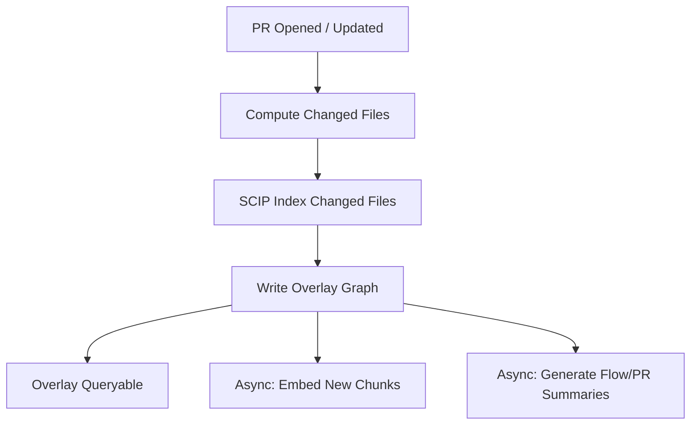

# Continuous Indexing & PR Overlays

This guide describes how CodeGraph can stay continuously updated (and queryable) by using a **main graph** plus **PR overlays**, rather than rewriting main on every pull request.

**Target SLA (initial):** PR overlay becomes queryable in ~3–4 minutes.

## Why Overlays

For enterprise workflows (review context, agents writing code, rapid debugging), you need “what is true on this PR branch right now” without destabilizing the main graph.

Overlays provide:

- fast incremental indexing
- safe rollback (delete overlay scope)
- deterministic review context (“show me what changed and what it impacts”)

## Scope Model

Every node and relationship must be queryable in one of two scopes:

- `main`: the currently promoted graph
- `pr`: an overlay graph for a PR head SHA

### Required scope properties

Add these properties to every indexed node and relationship:

- `tenantId`
- `repo`
- `scope`: `"main" | "pr"`
- `scopeId`: `"main"` for main, or PR identifier / head SHA for overlays
- `nodeKey`: stable identity key for nodes

> Important: `nodeKey` must not depend on database-native IDs (`elementId()`); it must be derived from SCIP or other stable naming.

## Stable Identity (nodeKey)

Overlays only work if “the same logical thing” has the same `nodeKey` across scopes.

### Prefer SCIP symbols

- `Symbol.nodeKey = symbol` (SCIP canonical symbol string)
- Other nodes should reference their defining SCIP symbol(s) whenever possible.

### Fallbacks (when SCIP is missing)

- `File.nodeKey = <repo>@<path>`
- `Function.nodeKey = <repo>@<path>#<signatureHash>`
- `Document.nodeKey = <source>:<url>`

## Overlay Write Rules

### 1. Only index deltas into overlay

On PR indexing:

1. compute changed files (git diff)
2. index only changed files / changed docs
3. write results into `scope=pr` / `scopeId=<prId>`

### 2. No destructive writes to main

Main remains immutable during PR analysis.

### 3. Deletions use tombstones

If a node is deleted in PR (file removed, symbol removed), represent this as a tombstone in overlay.

Two common patterns:

1. `(:Tombstone {nodeKey, tenantId, repo, scopeId, reason, createdAt})`
2. an overlay copy of the node with `deleted=true` (only safe if your query layer always respects it)

**Recommendation:** use a dedicated `Tombstone` node; it avoids accidentally mixing deleted nodes into search indexes.

## Query Precedence (Overlay Wins)

When querying, for a given `nodeKey`:

1. if a tombstone exists in overlay: treat node as deleted
2. else if node exists in overlay: use overlay version
3. else fall back to main

### Example: resolving a node by nodeKey

```cypher
// Inputs: $tenantId, $repo, $scopeId (pr id), $nodeKey
// Returns a single “effective” node (overlay preferred)

OPTIONAL MATCH (t:Tombstone {
  tenantId: $tenantId,
  repo: $repo,
  scope: 'pr',
  scopeId: $scopeId,
  nodeKey: $nodeKey
})
WITH t
WHERE t IS NULL

OPTIONAL MATCH (n_pr {tenantId: $tenantId, repo: $repo, scope: 'pr', scopeId: $scopeId, nodeKey: $nodeKey})
OPTIONAL MATCH (n_main {tenantId: $tenantId, repo: $repo, scope: 'main', scopeId: 'main', nodeKey: $nodeKey})

RETURN coalesce(n_pr, n_main) AS node
```

## Promotion On Merge

When a PR merges:

1. re-run a quick validation index (optional, but recommended)
2. copy overlay nodes/relationships into main (upsert by `nodeKey`)
3. apply tombstones as real deletes in main (or mark inactive)
4. drop overlay scope for that PR

This promotion can run asynchronously post-merge; the PR overlay continues to serve review workflows until promotion completes.

## CI Job Graph (3–4 Minute Target)



To hit the time budget:

- keep indexing incremental (changed files only)
- batch writes (avoid per-node queries)
- do embeddings + LLM summarization asynchronously

## Verification

Suggested automated checks for overlay correctness:

1. Overlay contains only changed file paths / affected symbols.
2. A node modified in PR resolves to overlay version.
3. A deleted node resolves to “not found” due to tombstone.
4. Search results include overlay nodes and exclude tombstoned main nodes.

See the step-by-step tasks in `12-implementation-plan.md`.
