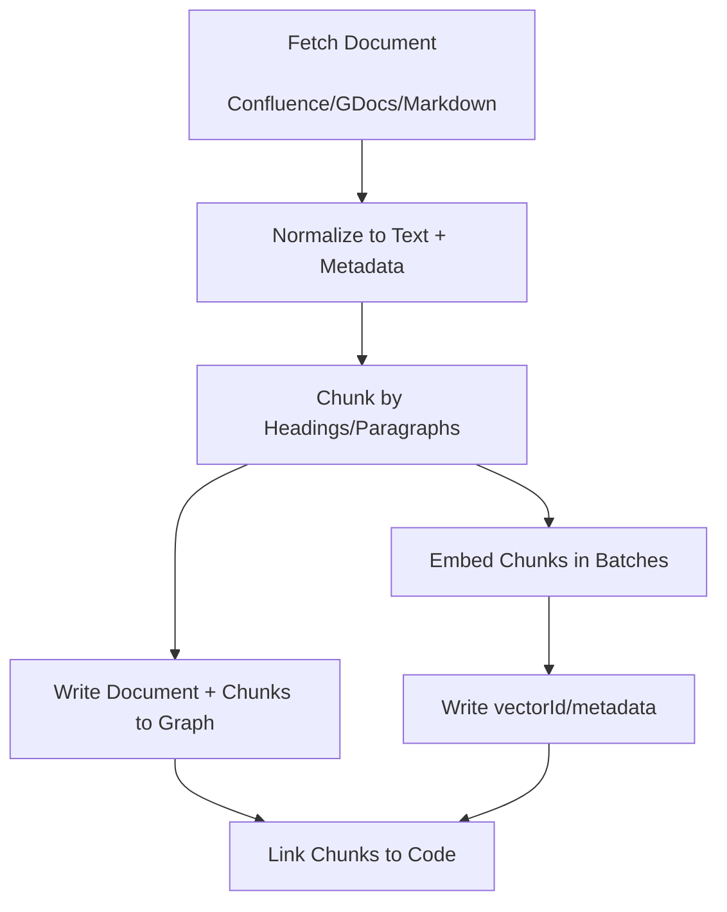
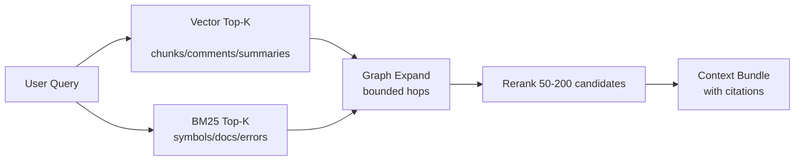

# Business Context Docs, Embeddings, and Linking

This guide describes how CodeGraph should ingest “business context” documents (Confluence / Google Docs / Markdown / docstrings), generate embeddings, and **correlate them with the code graph** so users and coding agents can query code in business terms.

## Requirements Recap

1. Documents may come from:
   - Confluence pages/spaces
   - Google Docs
   - Markdown in-repo
   - docstrings and comments
2. The system must:
   - chunk and embed documents
   - store embeddings in a scalable way
   - link documents to code nodes/flows with provenance
3. Retrieval must be accurate and responsive for enterprise-scale graphs.

## Knowledge Units

At scale, treating “documents” as monolithic nodes is too coarse. CodeGraph should represent **knowledge units**:

- `Document`: metadata and source identity
- `DocumentChunk`: the semantic unit that is embedded and linked
- `CommentChunk`: docstrings/comments extracted from code
- `GeneratedDoc`: flow summaries, PR summaries, docstring suggestions

### Suggested graph schema additions

Nodes:

- `DocumentChunk {nodeKey, documentKey, chunkId, heading, textHash, vectorId, scope, scopeId, repo, tenantId}`
- `GeneratedDoc {nodeKey, type, targetKey, textHash, vectorId, scope, scopeId, repo, tenantId}`

Relationships:

- `(Document)-[:HAS_CHUNK]->(DocumentChunk)`
- `(CodeNode)-[:HAS_COMMENT]->(CommentChunk)` (already approximated today via `Comment` nodes)
- `(DocumentChunk)-[:MENTIONS {confidence, reasons, source}]->(CodeNode)`
- `(GeneratedDoc)-[:DOCUMENTS]->(CodeNode)`
- `(GeneratedDoc)-[:DERIVED_FROM]->(DocumentChunk|CodeNode|PullRequest)`

## Three-Store Retrieval Architecture

Enterprise usage works best with three specialized stores:

1. **Graph store**: structure + ownership + call graph + inter-service edges + provenance.
2. **Vector store**: embeddings for `DocumentChunk`, `CommentChunk`, `GeneratedDoc`.
3. **Text store**: BM25 / exact keyword search.

### Why not only a graph store

Graph databases can store vectors, but high-volume embeddings (doc chunks across an org) quickly become the dominant storage and cache cost. Separating vector and text indexing provides:

- predictable latency
- easier scaling of embeddings independently
- better filters in vector retrieval (tenant/service/repo/scope)

## Document Ingestion Pipeline

### Chunking strategy

The current repo already has chunking logic in `pkg/indexer/documents/parser.go` (`ChunkDocument`). For enterprise use:

- chunk by headings first
- then by paragraph boundaries
- enforce a target token window (e.g., 300–800 tokens)
- store offsets + heading path so citations are stable

Store `textHash` for each chunk. Only embed and re-link chunks whose `textHash` changed.

## Linking Docs to Code

Document-to-code linking should be layered to maximize precision and debuggability.

### Linker 1: Explicit references

Match:

- backticked identifiers
- file paths
- endpoint paths (e.g., `/v1/users/{id}`)
- canonical symbols (SCIP symbol strings when present)

**Why**: explicit references are high precision and cheap.

### Linker 2: Semantic linking (embeddings)

Vector search over:

- `CommentChunk` (docstrings/comments)
- `GeneratedDoc` (flow summaries)
- optionally `Function`/`Class` summaries (not raw code)

Then attach links:

- `(DocumentChunk)-[:MENTIONS {confidence, reasons:['semantic']}]->(CodeNode)`

### Linker 3: Flow-aware linking

Many business docs describe flows rather than single symbols.

Approach:

1. identify likely entrypoints (API endpoints, consumers, jobs)
2. traverse the call graph with strict budgets (depth 1–2, top-N fanout)
3. link the doc chunk to the “flow spine” nodes

This creates a useful bridge from “business narrative” to “code execution path” without exploding the number of links.

## Retrieval: Candidate → Expand → Rerank

This is the retrieval pattern that stays fast as the graph grows.

### Budgeting recommendations

- cap candidates from vector + BM25 before graph expansion (e.g., 50–200)
- cap traversal depth (1–3)
- cap neighbor fanout per hop (top 20)
- restrict relationships by allowlist

## Verification

1. Index a small Confluence/GDoc export (or markdown folder) and confirm `DocumentChunk` nodes are created.
2. Verify embeddings exist for chunks and can be retrieved by vector search.
3. Verify explicit linking creates `MENTIONS` edges with `reasons=['explicit']`.
4. Verify semantic linking creates `MENTIONS` edges with `reasons=['semantic']` and `confidence`.
5. Verify a query returns a context bundle including citations to doc URL + heading and code file/line.

Implementation steps are broken down into independently committable tasks in `12-implementation-plan.md`.
