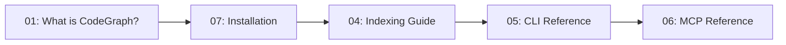
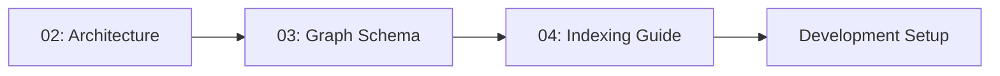
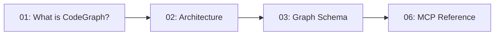

# CodeGraph Documentation Index

Welcome to the CodeGraph documentation! This guide will help you understand, install, and use CodeGraph effectively.

## 📚 Documentation Structure

The documentation is organized into 7 comprehensive guides:

### 1. [What is CodeGraph?](01-what-is-codegraph.md)
**Start here if you're new to CodeGraph**

- Overview of CodeGraph and its capabilities
- Key features and use cases
- Comparison with traditional code intelligence tools
- Architecture highlights
- Quick examples and getting started

**Read time:** 10-15 minutes

---

### 2. [Architecture](02-architecture.md)
**Deep dive into system design**

- System architecture overview with diagrams
- Component details (CLI, MCP Server, Indexing, Storage)
- Data flow and processing pipelines
- Performance considerations
- Scalability patterns

**Topics covered:**
- Client layer (CLI, MCP Server)
- Core services (LSP, Search, Architecture Analyzer)
- Indexing pipeline (SCIP, Documents, API Detection)
- Neo4j storage layer

**Read time:** 20-30 minutes

---

### 3. [Graph Schema](03-graph-schema.md)
**Understanding the data model**

- Complete schema with Mermaid diagrams
- Node types (Service, File, Symbol, Function, etc.)
- Relationship types (CONTAINS, CALLS, EXPOSES_API, etc.)
- Schema constraints and indexes
- Example Cypher queries
- Best practices

**Topics covered:**
- 10+ node types explained
- 10+ relationship types
- Uniqueness constraints
- Property and full-text indexes
- Vector indexes for embeddings
- Schema evolution patterns

**Read time:** 25-35 minutes

---

### 4. [Indexing Guide](04-indexing.md)
**How to index your codebase**

- SCIP indexing (multi-language, recommended)
- AST indexing (Go-only, legacy)
- Document indexing
- Feature linking with LLMs
- API pattern detection
- Cross-service relationship tracking

**Topics covered:**
- Language-specific indexing (Go, TypeScript, Python, Java)
- Monorepo and microservice strategies
- Incremental indexing (planned)
- Performance optimization
- Troubleshooting

**Read time:** 30-40 minutes

---

### 5. [CLI Reference](05-cli-reference.md)
**Complete command reference**

- All CLI commands with examples
- Global flags and configuration
- Environment variables
- LLM provider setup
- Exit codes and error handling

**Commands covered:**
- `status` - Check connection
- `schema` - Manage database schema
- `index` - Index code and documents
- `link` - Link features to code
- `query` - Search and analyze code

**Read time:** 20-25 minutes

---

### 6. [MCP Reference](06-mcp-reference.md)
**AI assistant integration**

- MCP server architecture
- Setup with Claude Code
- 12 available tools explained
- Usage examples
- Best practices
- Troubleshooting

**Tool categories:**
- **Code Intelligence** (search, source, analyze)
- **Document Intelligence** (index, show, link)
- **Service Architecture** (dependencies, APIs, call chains)

**Read time:** 25-30 minutes

---

### 7. [Installation](07-installation.md)
**Setup and configuration**

- One-command installation
- Manual installation steps
- Development setup
- Configuration files
- Platform-specific notes
- Troubleshooting
- Upgrade and uninstall

**Installation methods:**
- Automated installer (recommended)
- Manual installation
- Development setup

**Read time:** 15-20 minutes

---

## 🚀 Quick Start Paths

### Path 1: New User (Recommended)



1. Start with **[What is CodeGraph?](01-what-is-codegraph.md)** to understand the platform
2. Follow the **[Installation Guide](07-installation.md)** to set up
3. Learn **[Indexing](04-indexing.md)** to add your codebase
4. Use the **[CLI Reference](05-cli-reference.md)** for day-to-day tasks
5. Integrate with **[MCP Server](06-mcp-reference.md)** for AI assistance

### Path 2: Developer/Contributor



1. Study the **[Architecture](02-architecture.md)** to understand internals
2. Learn the **[Graph Schema](03-graph-schema.md)** for data modeling
3. Understand **[Indexing](04-indexing.md)** pipelines
4. Set up development environment via **[Installation](07-installation.md)**

### Path 3: Enterprise Architect



1. Review **[What is CodeGraph?](01-what-is-codegraph.md)** for capabilities
2. Evaluate **[Architecture](02-architecture.md)** for scalability
3. Assess **[Graph Schema](03-graph-schema.md)** for data modeling
4. Understand **[MCP Integration](06-mcp-reference.md)** for AI tools

## 📖 Additional Resources

### RFCs (Technical Specifications)

- **[RFC-002](rfc/RFC-002-COMPLIANCE.md)** - LLM-based feature linking specification
- See `docs/rfc/` for all RFCs

### Implementation Guides

- **[LLM Provider Migration](LLM_PROVIDER_MIGRATION.md)** - Multi-provider LLM setup
- **[LLM Implementation](LLM_IMPLEMENTATION.md)** - LLM integration details
- **[Polyglot Monorepo Design](15-polyglot-monorepo.md)** - Monorepo structure, tool choice, and phased refactor plan preserving graph+vector+text storage

### API Documentation

- **[CLAUDE.md](CLAUDE.md)** - Instructions for Claude Code when working with this repo

## 🔍 Finding Information

### By Topic

| Topic | Documents |
|-------|-----------|
| **Installation** | [07: Installation](07-installation.md) |
| **Basic Usage** | [05: CLI Reference](05-cli-reference.md), [06: MCP Reference](06-mcp-reference.md) |
| **Indexing** | [04: Indexing Guide](04-indexing.md) |
| **Architecture** | [02: Architecture](02-architecture.md) |
| **Data Model** | [03: Graph Schema](03-graph-schema.md) |
| **AI Integration** | [06: MCP Reference](06-mcp-reference.md) |
| **Troubleshooting** | Each guide has a troubleshooting section |

### By User Role

| Role | Recommended Reading |
|------|---------------------|
| **New User** | 01 → 07 → 04 → 05 |
| **Developer** | 02 → 03 → 04 → 05 |
| **DevOps/SRE** | 07 → 02 → 04 |
| **Architect** | 01 → 02 → 03 → 06 |
| **Product Manager** | 01 → 06 → 04 |

### By Task

| Task | Guide |
|------|-------|
| Install CodeGraph | [07: Installation](07-installation.md) |
| Index a project | [04: Indexing Guide](04-indexing.md) |
| Search for code | [05: CLI Reference](05-cli-reference.md#query-search) |
| Set up with Claude | [06: MCP Reference](06-mcp-reference.md#setup) |
| Understand schema | [03: Graph Schema](03-graph-schema.md) |
| Link features | [04: Indexing Guide](04-indexing.md#feature-linking) |
| Analyze architecture | [06: MCP Reference](06-mcp-reference.md#service-architecture-tools) |

## 📊 Documentation Statistics

| Document | Lines | Diagrams | Examples |
|----------|-------|----------|----------|
| 01: What is CodeGraph | ~275 | 9 | 10+ |
| 02: Architecture | ~575 | 6 | 15+ |
| 03: Graph Schema | ~600 | 2 | 20+ |
| 04: Indexing Guide | ~500 | 4 | 25+ |
| 05: CLI Reference | ~450 | 0 | 30+ |
| 06: MCP Reference | ~550 | 1 | 15+ |
| 07: Installation | ~500 | 1 | 20+ |
| **Total** | **~3,450** | **23** | **135+** |

## 🤝 Contributing to Documentation

Found an error or want to improve the docs?

1. Edit the relevant markdown file
2. Test Mermaid diagrams at https://mermaid.live
3. Ensure code examples are tested
4. Submit a pull request

## 📝 Document Conventions

### Mermaid Diagrams

All architecture and flow diagrams use Mermaid:

```markdown
\`\`\`mermaid
graph TB
    A[Node A] --> B[Node B]
\`\`\`
```

### Code Examples

Bash commands:
```bash
codegraph index scip ./project --service="name"
```

Cypher queries:
```cypher
MATCH (f:Function) RETURN f.name
```

### Conventions

- ✅ Checkmarks for completed features
- ❌ X marks for limitations
- ⚠️ Warning symbols for important notes
- 📖 Books for references
- 🚀 Rockets for quick starts

## 🔗 External Resources

- **Neo4j Documentation**: https://neo4j.com/docs/
- **SCIP Protocol**: https://github.com/sourcegraph/scip
- **Model Context Protocol**: https://modelcontextprotocol.io/
- **Claude Code**: https://claude.ai/code

## 📧 Getting Help

- **GitHub Issues**: https://github.com/techsavvyash/codegraph/issues
- **Discussions**: https://github.com/techsavvyash/codegraph/discussions
- **Email**: support@codegraph.dev (planned)

---

**Last Updated**: 2025-10-04  
**Version**: 1.0.0  
**Documentation Coverage**: 100%
