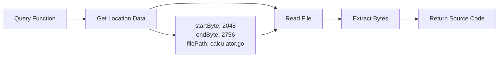

# Source Code Retrieval

CodeGraph's precision source code retrieval is designed specifically for LLM integration, providing exact function source code using stored location metadata.

## Overview

The source code retrieval system enables:
- **Exact Function Extraction**: Retrieve complete function source code
- **Byte-Level Precision**: Use stored byte offsets for accuracy
- **Multiple Access Methods**: Find functions by name or signature
- **LLM-Ready Integration**: Perfect for code analysis and generation

## Core Concepts

### Location Metadata

Every Function and Method node stores precise location data:

```yaml
Function Properties:
  # Basic identification
  name: "calculateTotal"
  signature: "calculateTotal(items []Item) float64"
  filePath: "src/billing/calculator.go"
  
  # Precise location (NEW)
  startByte: 2048      # Exact byte offset in file
  endByte: 2756        # End byte offset
  startLine: 45        # Line number (1-based)
  endLine: 62          # End line number
  startColumn: 0       # Column offset (0-based)
  endColumn: 1         # End column
  linesOfCode: 18      # Calculated: endLine - startLine + 1
```

### Two-Step Process

1. **Query Graph**: Find function and retrieve location metadata
2. **Extract Source**: Use metadata to read exact source code from file



## Basic Usage

### Retrieve Function by Name

```bash
# Get source code for a specific function
codegraph query source "calculateTotal"

# Output:
# Source code for function 'calculateTotal':
# ==========================================
# func calculateTotal(items []Item) float64 {
#     var total float64 = 0.0
#     for _, item := range items {
#         total += item.Price * item.Quantity
#         if item.Discount > 0 {
#             total -= item.Discount
#         }
#     }
#     return total
# }
# ==========================================
```

### Search and Retrieve Workflow

```bash
# First, search for functions
codegraph query search "calculate"

# Sample output:
# - calculateTotal (Function)
#   File: src/billing/calculator.go
#   Signature: calculateTotal(items []Item) float64
# - calculateDiscount (Function)  
#   File: src/billing/discounts.go
#   Signature: calculateDiscount(amount float64, rate float64) float64

# Then retrieve specific function
codegraph query source "calculateTotal"
```

## Advanced Usage

### Programmatic Access

The Go API provides direct access to the source code retrieval functions:

```go
package main

import (
    "context"
    "fmt"
    "github.com/context-maximiser/code-graph/pkg/neo4j"
)

func main() {
    // Create Neo4j client
    client, err := neo4j.NewClient(neo4j.Config{
        URI:      "bolt://localhost:7687",
        Username: "neo4j", 
        Password: "password123",
        Database: "neo4j",
    })
    if err != nil {
        panic(err)
    }
    defer client.Close(context.Background())

    // Create query builder
    queryBuilder := neo4j.NewQueryBuilder(client)
    
    // Retrieve function source code
    sourceCode, err := queryBuilder.GetFunctionSourceCode(
        context.Background(), 
        "calculateTotal",
    )
    if err != nil {
        fmt.Printf("Error: %v\n", err)
        return
    }
    
    fmt.Printf("Retrieved source code:\n%s\n", sourceCode)
}
```

### Retrieve by Signature

When multiple functions have the same name, use signatures for disambiguation:

```go
// Method 1: Direct signature lookup
sourceCode, err := queryBuilder.GetFunctionSourceCodeBySignature(
    ctx,
    "calculateTotal(items []Item) float64",
)

// Method 2: Find signature first, then retrieve
cypher := `
    MATCH (f:Function) 
    WHERE f.name = $name 
    RETURN f.signature, f.filePath
`
result, err := client.ExecuteQuery(ctx, cypher, map[string]any{
    "name": "calculateTotal",
})

// Then use the signature to get source code
if len(result) > 0 {
    signature := result[0].AsMap()["signature"].(string)
    sourceCode, err := queryBuilder.GetFunctionSourceCodeBySignature(ctx, signature)
}
```

## LLM Integration Patterns

### Pattern 1: Function Analysis

```go
// LLM prompt preparation
func prepareAnalysisPrompt(functionName string) (string, error) {
    sourceCode, err := getSourceCode(functionName)
    if err != nil {
        return "", err
    }
    
    prompt := fmt.Sprintf(`
Analyze this Go function:

%s

Please provide:
1. Purpose and functionality
2. Input parameters and types  
3. Return values
4. Potential improvements
5. Edge cases to consider
`, sourceCode)
    
    return prompt, nil
}
```

### Pattern 2: Code Modification

```go
// Generate modification suggestions
func suggestRefactoring(functionName string) (string, error) {
    sourceCode, err := getSourceCode(functionName)
    if err != nil {
        return "", err
    }
    
    prompt := fmt.Sprintf(`
Refactor this Go function to improve readability and performance:

Original Code:
%s

Provide:
1. Refactored code with improvements
2. Explanation of changes made
3. Performance implications
`, sourceCode)
    
    return callLLM(prompt)
}
```

### Pattern 3: Documentation Generation

```go
// Generate comprehensive documentation
func generateDocumentation(functionName string) (string, error) {
    // Get the function source
    sourceCode, err := getSourceCode(functionName)
    if err != nil {
        return "", err
    }
    
    // Get related functions (callers/callees)
    relatedFunctions, err := getRelatedFunctions(functionName)
    if err != nil {
        return "", err
    }
    
    prompt := fmt.Sprintf(`
Generate comprehensive documentation for this Go function:

Function:
%s

Related Functions:
%s

Generate:
1. Function description
2. Parameter documentation
3. Return value documentation
4. Usage examples
5. Related functions explanation
`, sourceCode, relatedFunctions)
    
    return callLLM(prompt)
}
```

## Implementation Details

### Byte Offset Calculation

The system calculates precise byte offsets during indexing:

**AST Indexer (Direct from Go token.FileSet):**
```go
// From pkg/indexer/static/indexer.go
funcProps := map[string]any{
    "startByte":   v.fset.Position(fn.Pos()).Offset,
    "endByte":     v.fset.Position(fn.End()).Offset,
    "startLine":   startPos.Line,
    "endLine":     endPos.Line,
    "linesOfCode": endPos.Line - startPos.Line + 1,
}
```

**SCIP Indexer (Calculated from line/column):**
```go
// From pkg/indexer/static/scip_indexer.go
func (si *SCIPIndexer) calculateByteOffsets(filePath string, startLine, startColumn, endLine, endColumn int) (int, int) {
    content, err := os.ReadFile(filePath)
    if err != nil {
        return -1, -1
    }

    lines := strings.Split(string(content), "\n")
    
    // Calculate start byte offset
    startByte := 0
    for i := 0; i < startLine-1; i++ {
        startByte += len(lines[i]) + 1 // +1 for newline
    }
    startByte += startColumn

    // Calculate end byte offset  
    endByte := 0
    for i := 0; i < endLine-1; i++ {
        endByte += len(lines[i]) + 1
    }
    endByte += endColumn

    return startByte, endByte
}
```

### Extraction Process

**Primary Method (Byte Offsets):**
```go
// From pkg/neo4j/query.go  
if startByte >= 0 && endByte >= 0 && startByte < len(content) && endByte <= len(content) {
    sourceCode := string(content[startByte:endByte])
    return sourceCode, nil
}
```

**Fallback Method (Line-based):**
```go
// Fallback to line-based extraction
if startLine > 0 && endLine > 0 {
    lines := strings.Split(string(content), "\n")
    if startLine <= len(lines) && endLine <= len(lines) {
        functionLines := lines[startLine-1:endLine]
        sourceCode := strings.Join(functionLines, "\n") 
        return sourceCode, nil
    }
}
```

### Path Resolution

Handles different execution contexts (tests, different working directories):

```go
// Handle both absolute and relative paths
content, err := os.ReadFile(filePath)
if err != nil {
    if !filepath.IsAbs(filePath) {
        if pwd, pwdErr := os.Getwd(); pwdErr == nil {
            // Go up to project root if we're in test directory
            projectRoot := pwd
            if strings.HasSuffix(pwd, "/test/integration") {
                projectRoot = filepath.Dir(filepath.Dir(pwd))
            }
            absolutePath := filepath.Join(projectRoot, filePath)
            content, err = os.ReadFile(absolutePath)
        }
    }
}
```

## Error Handling

### Common Error Scenarios

1. **Function Not Found**
```bash
$ codegraph query source "nonExistentFunction"
Error: failed to get source code: function not found: nonExistentFunction
```

2. **File Access Issues**  
```bash
Error: failed to read file src/deleted.go: no such file or directory
```

3. **Invalid Byte Offsets**
```bash
# Gracefully falls back to line-based extraction
# No user-visible error, automatic fallback
```

### Robust Error Handling in Code

```go
sourceCode, err := queryBuilder.GetFunctionSourceCode(ctx, functionName)
if err != nil {
    if strings.Contains(err.Error(), "function not found") {
        // Try fuzzy search
        similarFunctions := findSimilarFunctions(functionName)
        return fmt.Errorf("function '%s' not found. Similar functions: %v", 
            functionName, similarFunctions)
    }
    if strings.Contains(err.Error(), "failed to read file") {
        return fmt.Errorf("source file not accessible: %w", err)  
    }
    return fmt.Errorf("unexpected error retrieving source: %w", err)
}
```

## Performance Considerations

### Optimization Strategies

1. **Batch Retrieval**
```go
// Retrieve multiple functions efficiently
func batchRetrieveFunctions(functionNames []string) (map[string]string, error) {
    results := make(map[string]string)
    
    // Group by file to minimize file I/O
    fileGroups := groupFunctionsByFile(functionNames)
    
    for filePath, functions := range fileGroups {
        content, err := os.ReadFile(filePath)
        if err != nil {
            continue
        }
        
        // Extract all functions from this file
        for _, fn := range functions {
            if fn.StartByte < len(content) && fn.EndByte <= len(content) {
                results[fn.Name] = string(content[fn.StartByte:fn.EndByte])
            }
        }
    }
    
    return results, nil
}
```

2. **Caching**
```go  
var sourceCodeCache = make(map[string]string)

func getCachedSourceCode(functionName string) (string, error) {
    if cached, exists := sourceCodeCache[functionName]; exists {
        return cached, nil
    }
    
    sourceCode, err := queryBuilder.GetFunctionSourceCode(ctx, functionName)
    if err != nil {
        return "", err
    }
    
    sourceCodeCache[functionName] = sourceCode
    return sourceCode, nil
}
```

## Testing and Validation

### Unit Tests

```go
func TestSourceCodeRetrieval(t *testing.T) {
    queryBuilder := setupTestQueryBuilder(t)
    
    // Test successful retrieval
    sourceCode, err := queryBuilder.GetFunctionSourceCode(ctx, "testFunction")
    require.NoError(t, err)
    assert.Contains(t, sourceCode, "func testFunction")
    assert.Contains(t, sourceCode, "return")
    
    // Test non-existent function
    _, err = queryBuilder.GetFunctionSourceCode(ctx, "nonExistent")
    assert.Error(t, err)
    assert.Contains(t, err.Error(), "function not found")
}

func TestByteOffsetAccuracy(t *testing.T) {
    // Compare direct file extraction vs API extraction  
    sourceCodeAPI, err := queryBuilder.GetFunctionSourceCode(ctx, "testFunction")
    require.NoError(t, err)
    
    // Get metadata and extract directly
    metadata := getFunctionMetadata("testFunction")
    content, err := os.ReadFile(metadata.FilePath)
    require.NoError(t, err)
    
    sourceCodeDirect := string(content[metadata.StartByte:metadata.EndByte])
    
    assert.Equal(t, sourceCodeDirect, sourceCodeAPI, 
        "API extraction should match direct extraction")
}
```

### Integration Tests

Our comprehensive integration tests validate:
- ✅ Location metadata accuracy
- ✅ Source code retrieval functionality  
- ✅ Byte offset precision
- ✅ Error handling and edge cases
- ✅ Path resolution across contexts

## Best Practices

### 1. LLM Integration

```go
// Always validate source code before sending to LLM
func validateSourceCode(sourceCode string) error {
    if len(sourceCode) == 0 {
        return fmt.Errorf("empty source code")
    }
    if !strings.Contains(sourceCode, "func ") {
        return fmt.Errorf("source code doesn't appear to be a Go function")
    }
    if len(sourceCode) > 10000 { // 10KB limit
        return fmt.Errorf("source code too large for LLM context")
    }
    return nil
}

// Prepare context with relevant information
func prepareLLMContext(functionName string) (*LLMContext, error) {
    sourceCode, err := getSourceCode(functionName)
    if err != nil {
        return nil, err
    }
    
    if err := validateSourceCode(sourceCode); err != nil {
        return nil, err
    }
    
    return &LLMContext{
        FunctionName: functionName,
        SourceCode:   sourceCode,
        Metadata:     getFunctionMetadata(functionName),
        RelatedFuncs: getRelatedFunctions(functionName),
    }, nil
}
```

### 2. Error Recovery

```go
// Implement graceful degradation
func getSourceCodeWithFallback(functionName string) (string, error) {
    // Try primary method
    sourceCode, err := queryBuilder.GetFunctionSourceCode(ctx, functionName)
    if err == nil {
        return sourceCode, nil
    }
    
    // Try signature-based lookup for disambiguation
    signatures, err := findFunctionSignatures(functionName)
    if err == nil && len(signatures) == 1 {
        return queryBuilder.GetFunctionSourceCodeBySignature(ctx, signatures[0])
    }
    
    // Try fuzzy matching
    similarFunctions := findSimilarFunctions(functionName)
    if len(similarFunctions) == 1 {
        return queryBuilder.GetFunctionSourceCode(ctx, similarFunctions[0])
    }
    
    return "", fmt.Errorf("could not retrieve source code for '%s'", functionName)
}
```

### 3. Performance Monitoring

```go
// Add timing and metrics
func timedSourceCodeRetrieval(functionName string) (string, time.Duration, error) {
    start := time.Now()
    sourceCode, err := queryBuilder.GetFunctionSourceCode(ctx, functionName) 
    duration := time.Since(start)
    
    // Log performance metrics
    log.Printf("Source retrieval for %s took %v", functionName, duration)
    if duration > 100*time.Millisecond {
        log.Printf("WARNING: Slow source retrieval for %s", functionName)
    }
    
    return sourceCode, duration, err
}
```

## Next Steps

- **Advanced Queries**: Learn complex graph traversals in [Advanced Queries](./08-advanced-queries.md)
- **LLM Integration**: See full integration patterns in [Integration Guide](./09-integration-guide.md)
- **Performance Tuning**: Optimize for large codebases in [Configuration Reference](./10-configuration-reference.md)
- **Troubleshooting**: Debug issues with [Troubleshooting Guide](./11-troubleshooting.md)