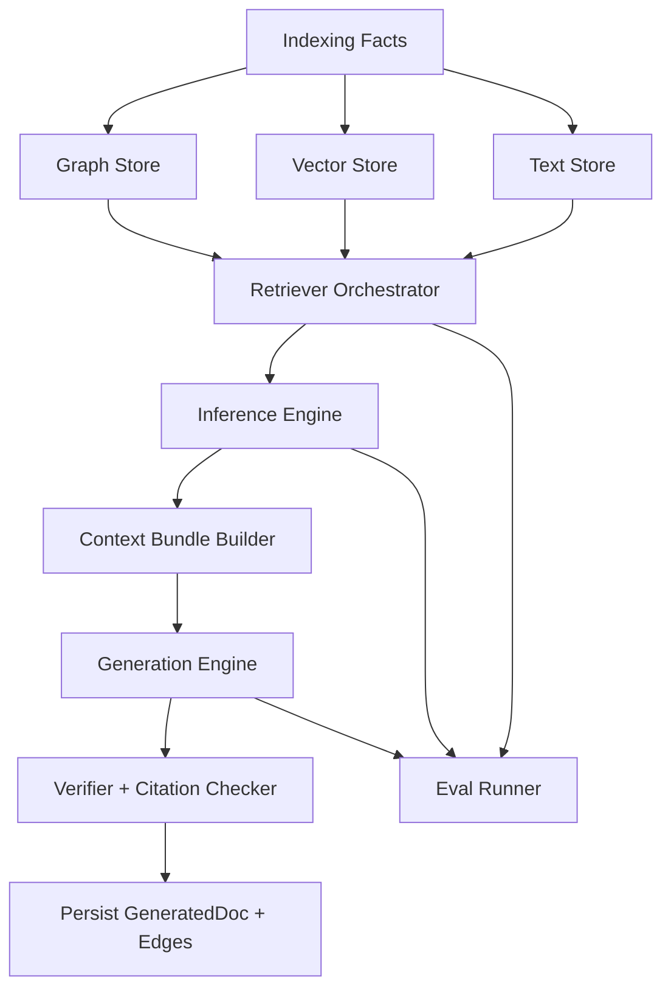

# RFC 009: Evidence-Driven Intelligence Architecture

**Author:** Code Graph Team  
**Date:** 2026-02-28  
**Status:** Superseded by RFC-005  
**Version:** 1.0

> **Status note:** The evidence-first principles here (every inferred link, flow,
> and generated sentence must be explainable through graph-backed evidence) were
> carried forward into RFC-005 as the provenance invariant (I4). The concrete
> architecture proposed in this document is obsolete — see
> `005-grounded-context-engine.md`.

## Summary

This RFC defines the target architecture for moving CodeGraph from prototype-grade heuristic linking to production-grade, evidence-driven intelligence.

The core principle: every inferred link, flow, and generated documentation sentence must be explainable through graph-backed evidence and measurable by evaluation suites.

## Problem Statement

Current behavior mixes deterministic graph facts with heuristic shortcuts (framework assumptions, keyword-heavy matching, ad-hoc confidence mapping). This makes the system useful for demos but fragile for enterprise-scale usage where correctness and trust are required.

We need:

1. Clear package boundaries so retrieval, inference, and generation evolve independently.
2. Repeatable feedback loops with quality gates.
3. Scope-correct, provenance-rich outputs by default.

## Goals

1. Graph-first and evidence-first query, linking, and generation.
2. Framework-agnostic flow and capability inference.
3. Stable contracts between indexing, retrieval, inference, and generation layers.
4. Evaluation-driven delivery with CI regression gates.
5. End-to-end traceability: every output maps to specific graph evidence.

## Non-Goals

1. Replacing existing indexers immediately.
2. Building a static site documentation generator.
3. Solving all language-specific flow detection edge cases in one phase.

## Design Principles

1. Deterministic first: infer from graph structures before LLM reasoning.
2. Bounded context: every inference runs within explicit traversal budgets.
3. Scope safety: overlay/main resolution is mandatory in all stores.
4. Provenance always-on: inferred edges and generated docs carry reasons and source IDs.
5. Evaluations as API contracts: quality regressions block rollout.

## Target Architecture



## Package Boundaries

The table below defines target modules. Existing packages can be migrated incrementally by moving logic behind these interfaces.

1. `libs/facts-go`
- Responsibility: normalized facts emitted from code/doc indexers.
- Inputs: SCIP/AST/doc parser outputs.
- Outputs: strongly typed fact records.

2. `libs/graph-store-go`
- Responsibility: Neo4j persistence and scoped resolution.
- Inputs: fact records, inference outputs.
- Outputs: stored nodes/edges, scoped fetch APIs.

3. `libs/retrieval-go`
- Responsibility: hybrid candidate retrieval (graph + vector + text) with unified result schema.
- Inputs: query intent + scope + budgets.
- Outputs: `CandidateSet` with reasons and source scores.

4. `libs/inference-go`
- Responsibility: linking, flow inference, dependency inference, confidence calibration.
- Inputs: `CandidateSet`, graph neighborhoods.
- Outputs: inferred entities/edges with confidence + rationale.

5. `libs/context-bundles-go`
- Responsibility: build bounded evidence bundles for a target task.
- Inputs: inferred anchors (flow, symbol, service, feature).
- Outputs: citation-ready context bundles.

6. `libs/generation-go`
- Responsibility: prompt assembly, schema-constrained generation, citation injection.
- Inputs: context bundles.
- Outputs: `GeneratedDocDraft` with statement-level citations.

7. `libs/verification-go`
- Responsibility: statement/evidence validation and policy checks.
- Inputs: draft output + cited evidence.
- Outputs: pass/fail, corrections, confidence adjustments.

8. `libs/evals-go`
- Responsibility: offline and CI evaluation suites.
- Inputs: golden datasets + live pipelines.
- Outputs: metrics, regression signals, release gates.

## Canonical Interface Contracts

```go
// libs/retrieval-go/contracts.go
type RetrievalRequest struct {
    Query   string
    ScopeID string
    Limit   int
    Budget  TraversalBudget
}

type Candidate struct {
    NodeKey      string
    Labels       []string
    Score        float64
    SignalScores map[string]float64 // vector, text, structural
    Reasons      []string
    EvidenceRefs []EvidenceRef
}

type CandidateSet struct {
    Candidates []Candidate
    Metadata   map[string]any
}

type Retriever interface {
    Retrieve(ctx context.Context, req RetrievalRequest) (*CandidateSet, error)
}
```

```go
// libs/inference-go/contracts.go
type InferenceInput struct {
    ScopeID      string
    CandidateSet *CandidateSet
}

type InferredEdge struct {
    FromKey     string
    ToKey       string
    Type        string
    Confidence  float64
    Reasons     []string
    EvidenceRefs []EvidenceRef
}

type InferenceResult struct {
    Edges    []InferredEdge
    Anchors  []string
    Debug    map[string]any
}

type Inferencer interface {
    Infer(ctx context.Context, in InferenceInput) (*InferenceResult, error)
}
```

```go
// libs/context-bundles-go/contracts.go
type BundleRequest struct {
    ScopeID string
    Anchors []string
    Budget  TraversalBudget
}

type EvidenceBundle struct {
    Nodes      []map[string]any
    Edges      []map[string]any
    Citations  []EvidenceRef
    Summaries  []string
}

type BundleBuilder interface {
    Build(ctx context.Context, req BundleRequest) (*EvidenceBundle, error)
}
```

```go
// libs/generation-go/contracts.go
type GenerationRequest struct {
    ScopeID string
    Task    string // flow_summary, pr_summary, docs_section, docstring
    Bundle  *EvidenceBundle
}

type Statement struct {
    Text      string
    Citations []EvidenceRef
}

type GeneratedDocDraft struct {
    Title      string
    Statements []Statement
    Metadata   map[string]any
}

type Generator interface {
    Generate(ctx context.Context, req GenerationRequest) (*GeneratedDocDraft, error)
}
```

```go
// libs/verification-go/contracts.go
type VerificationResult struct {
    Valid             bool
    CitationCoverage  float64
    UnsupportedClaims []string
    Warnings          []string
}

type Verifier interface {
    Verify(ctx context.Context, draft *GeneratedDocDraft, bundle *EvidenceBundle) (*VerificationResult, error)
}
```

## Data and Provenance Requirements

All inferred and generated artifacts must include:

1. `scope`, `scopeId`, `repo`, `tenantId`.
2. `model` (if LLM-involved), `strategy` (deterministic, hybrid, llm-validated).
3. `confidence`, `reasons`, `createdAt`.
4. `evidenceRefs` (node keys, edge signatures, file ranges when available).

## Testing and Evaluation Strategy

### Unit Tests

1. Candidate fusion and scoring functions.
2. Confidence calibration mappings.
3. Scope and overlay precedence behavior.
4. Citation validator logic.

### Integration Tests

1. End-to-end retrieval + inference + persistence in scoped overlays.
2. Delayed doc ingestion and re-linking behavior.
3. Flow derivation fallback behavior without framework route nodes.

### Golden Evaluation Suites

1. `linking-golden`: query/chunk to expected code anchors.
2. `flow-golden`: entrypoint to expected step set.
3. `docs-golden`: generated statements must cite valid evidence.

### Metrics (CI Gate Candidates)

1. Retrieval: Recall@K, nDCG@K, MRR.
2. Linking: precision, recall, calibration error.
3. Flow: step coverage, spurious-step rate.
4. Generation: citation coverage, unsupported-claim rate.
5. Runtime: p50/p95 latency and token cost.

## Delivery Plan

### M0: Contract Layer

1. Introduce interfaces and shared DTOs.
2. Add adapter wrappers around existing packages.
3. No behavior change required.

### M1: Retrieval Stabilization

1. Enforce scoped IDs/filters across vector/text/graph paths.
2. Add candidate envelope format and reason tracking.
3. Add retrieval eval suite.

### M2: Inference Refactor

1. Move linker and flow logic into `libs/inference-go` with pure scoring modules.
2. Replace framework-first logic with structure-first seeds + fallbacks.
3. Add inference calibration and ablation tests.

### M3: Bundle + Generation + Verification

1. Build bounded evidence bundles per task.
2. Generate with required citations.
3. Reject/repair unsupported claims with verifier.

### M4: Release Gates and Ops

1. Turn eval thresholds into CI blocking checks.
2. Add dashboard for quality, latency, and drift.
3. Enable staged rollout and shadow evaluation mode.

## Migration From Current Repo

Initial mappings:

1. `libs/search-go/*` -> `libs/retrieval-go` + `libs/inference-go` split.
2. `libs/query-go/flow_spine.go` -> inference flow module + bundle assembler.
3. `libs/indexer-go/generated/context.go` -> generation + verification pipeline.
4. `apps/cli/main.go` -> thin orchestrator over contracts.

## Open Questions

1. Which default confidence threshold should be policy-enforced per edge type?
2. Should verifier be hard-fail or soft-fail for missing citations in developer mode?
3. Which languages need dedicated flow seed extractors first after structure-first baseline?

## Exit Criteria

This RFC is considered implemented when:

1. Package boundaries and contracts are in place and used by CLI orchestration.
2. All generated docs have statement-level citations.
3. Golden eval suites run in CI with threshold gating.
4. Scoped overlay correctness is validated across retrieval and inference.
5. Feature-level and flow-level regressions are observable before release.
